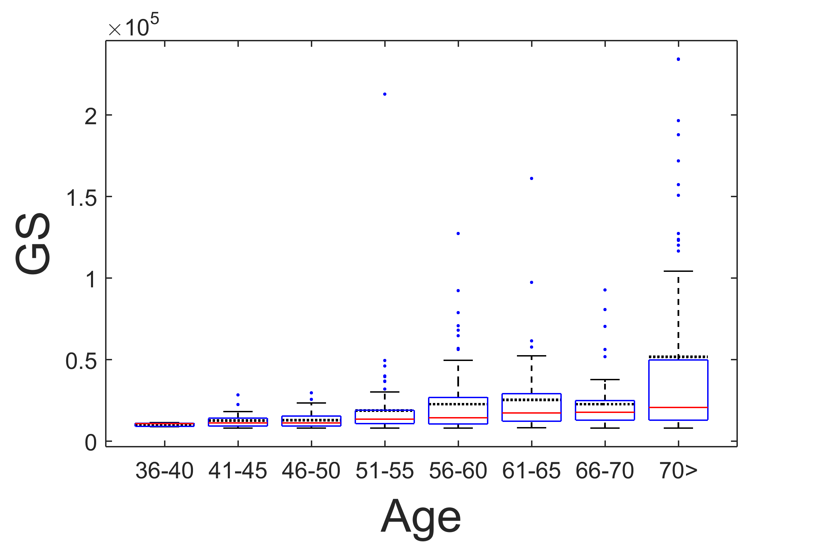
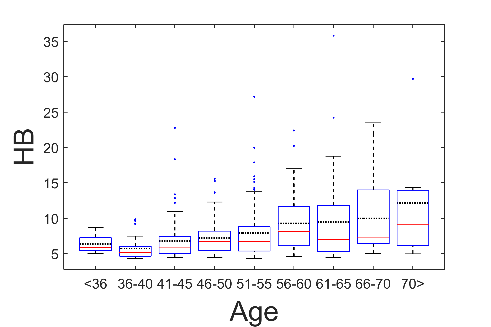
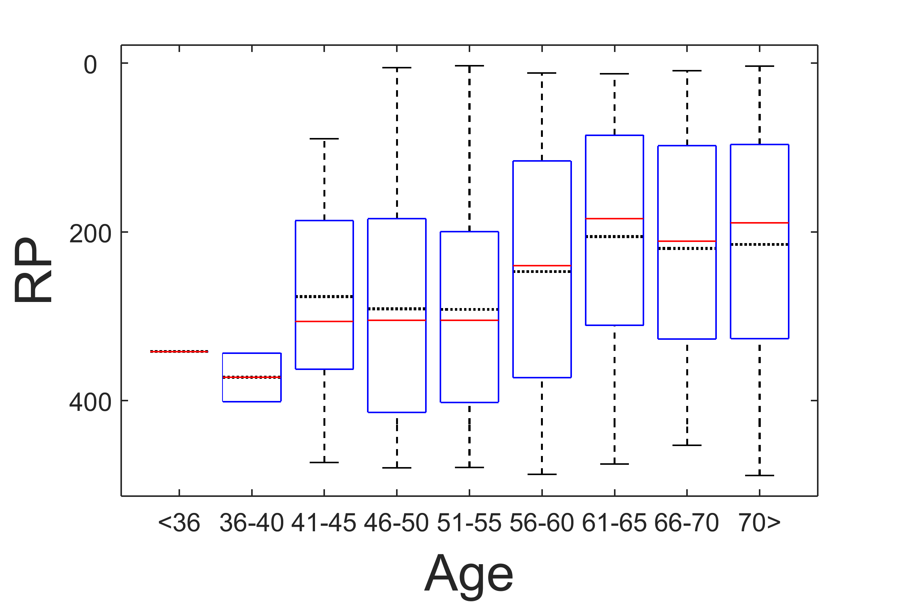

[](http://quantlet.de/)

## [](http://quantlet.de/) **ARRboxage** [](http://quantlet.de/)

```yaml

Name of QuantLet : ARRboxage

Published in : ARR - Academic Rankings Research

Description : 'Creates boxplots of the main scores of Handelsblatt (HB), RePEc (RP) and Google
Scholar (GS) rankings over the age intervalls: <35, 36-40, 41-45, 46-50, 51-55, 56-60, 61-65,
66-70, 71>'

Keywords : 'plot, dependence, multivariate, multivariate analysis, visualization, data
visualization, analysis, descriptive-methods, descriptive, graphical representation, boxplot,
descriptive-statistics, five number summary'

See also : 'ARRboxgscit, ARRboxhb, ARRcormer, ARRdenmer2d, ARRdenmer3d, ARRhexage, ARRhexcit,
ARRhexhin, ARRhismer, ARRmosage, ARRmosagegr, ARRmossub, ARRpcpgscit, ARRpcphb, ARRpcpmer,
ARRpcprp, ARRqrqqhb, ARRscaage, ARRscamer'

Author : Alona Zharova

Submitted : Sat, April 30 2016 by Alona Zharova, Marius Sterling

Datafile : 'ARRdatage.csv - The data set contains the top ranked researchers and there estimated
age of HB, GS, RP'

Output : 'Boxplots for age and ranking scores of HB, RP and GS for Top-458 scientists within each
ranking system for December 2015. The red lines denote the median, whereas the dotted lines
introduce the mean.'

```








### MATLAB Code:
```matlab
%% Clearing all variables
clear all; clc;
%% Image settings
fonttype      = 'Helvetica';
fontsize      = 24;
fontsize_axes = 12;
papersize     = [15 10];
%% Data input
subage   = readtable('ARRdatage.csv','Delimiter',';');
%% Data selection
subagehb = table2array(subage(:, 1:2));
subagerp = table2array(subage(:, 3:4));
subagegs = table2array(subage(:, 5:6));
%% Data 
ages     = [0 35 40 45 50 55 60 65 70 999];
label    = {'<36' '36-40' '41-45' '46-50' '51-55' '56-60' '61-65' '66-70' '70>'};
%% Creating figures with the function
ARRboxage_fun(subagehb,papersize,label,fontsize,fontsize_axes,fonttype,'ARRboxage_HB','Age','HB',ages)
ARRboxage_fun(subagerp,papersize,label,fontsize,fontsize_axes,fonttype,'ARRboxage_RP','Age','RP',ages)
ARRboxage_fun(subagegs,papersize,label,fontsize,fontsize_axes,fonttype,'ARRboxage_GS','Age','GS',ages)

```
