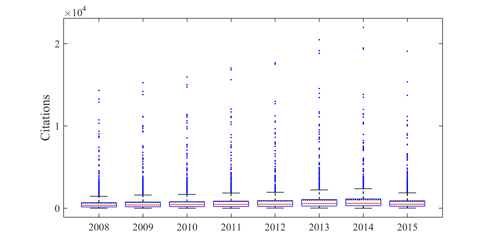
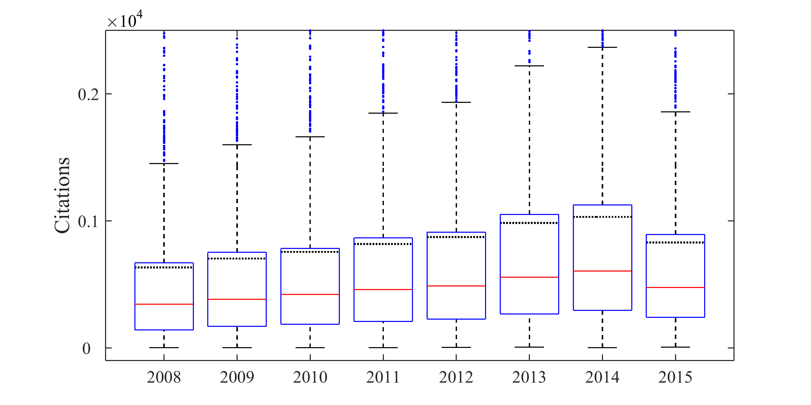

[](http://quantlet.de/)

## [](http://quantlet.de/) **ARRboxgscit** [](http://quantlet.de/)

```yaml

Name of QuantLet : ARRboxgscit

Published in : ARR - Academic Rankings Research

Description : Creates boxplots for Google Scholar (GS) citations for the period from 2008 till 2015

Keywords : 'plot, correlation, dependence, multivariate, multivariate analysis, visualization, data
visualization, analysis, descriptive-methods, descriptive, graphical representation, boxplot,
descriptive-statistics, five number summary'

See also : 'ARRboxage, ARRboxhb, ARRcormer, ARRdenmer2d, ARRdenmer3d, ARRhexage, ARRhexcit,
ARRhexhin, ARRhismer, ARRmosage, ARRmosagegr, ARRmossub, ARRpcpgscit, ARRpcphb, ARRpcpmer,
ARRpcprp, ARRqrqqhb, ARRscaage, ARRscamer'

Author : Alona Zharova

Submitted : Sat, April 30 2016 by Alona Zharova, Marius Sterling

Datafile : 'ARRdata.dat - The data set contains different researcher (3218 rows) of either RePEc
(77 columns), Handelsblatt (48 columns) ranking or both and their Google Scholar data (16 columns)
as well as age and subject fields (2 columns)'

Output : 'Boxplot for GS citations from 2008 to 2015 for selected 1357 researchers. The red lines
denote the median, whereas the dotted lines represent the mean'

```






### MATLAB Code:
```matlab
%%  Clearing all variables
clear all; clc;
%% Image settings
fonttype      = 'Times';
fontsize      = 15;
fontsize_axes = 12;
papersize     = [20 10];
%% Data input
merge        = readtable('ARRdata.dat','Delimiter',';');
%% Data selection (here all Google Scholar Citations over the years 2008 till 2015)
substrmatch  = @(x,y) ~cellfun(@isempty,strfind(y,x));
findmatching = @(x,y) y(substrmatch(x,y));
x            = sort(findmatching('gs_citation_20',merge.Properties.VariableNames));
x            = x(2:size(x,2));
TF           = ismissing(merge(:,x)); % selecting only the researchers having scores in all years
z            = table2array(merge(~any(TF,2),x));
label        = {'2008','2009','2010','2011','2012','2013','2014','2015'};
%% Creating figure
figure1 = figure('Visible','on','PaperPosition',[0 0 papersize],'PaperSize',papersize);
    m   = mean(z);
    hold on
    % plotting the mean values
    for l_i = 1:length(m)
        a   = 0.6+l_i-1;
        b   = 1.4+l_i-1;
        line([a b],[m(l_i) m(l_i)],'Color','k','LineStyle',':','LineWidth',1.2);
    end
    % plotting the boxplots
    boxplot(z,'Symbol','.','labels',label,'widths',0.8)
    % setting the axis labels
    set(gca,'FontSize',fontsize_axes,'FontName',fonttype,...'YTickLabel',[0:2],
        'YTick',[0:10000:20000]);
    ylabel('Citations','FontSize',fontsize,'FontName',fonttype);
    hold off
%% Saving figure
set(figure1,'Position',[0 0 1 1]);
print(figure1,'-dpng','-r400','ARRboxgscit');
%% Saving an image detail
ylim([-100 2500])
set(gca,'YTickLabel',[0:0.1:0.2],'YTick',[0:1000:2000]);
yl = ylim;
xl = xlim;
text(xl(1),yl(2),sprintf('\\times10^%d',4),'fontsize',fontsize_axes,'FontName',fonttype,'VerticalAlignment','bottom');
print(figure1,'-dpng','-r400','ARRboxgscit_zoom');
```
