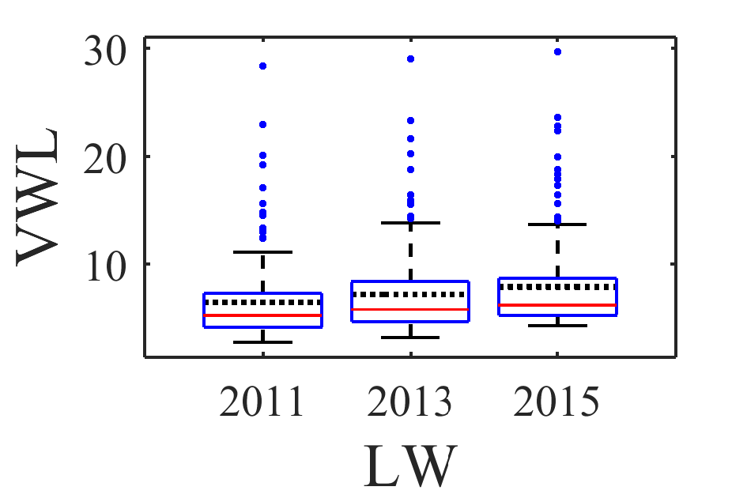
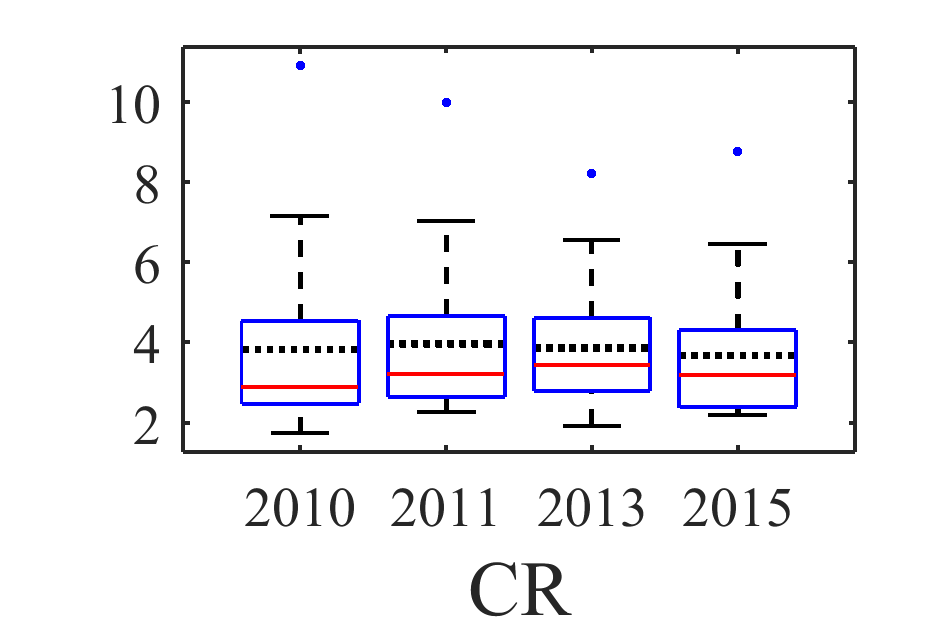
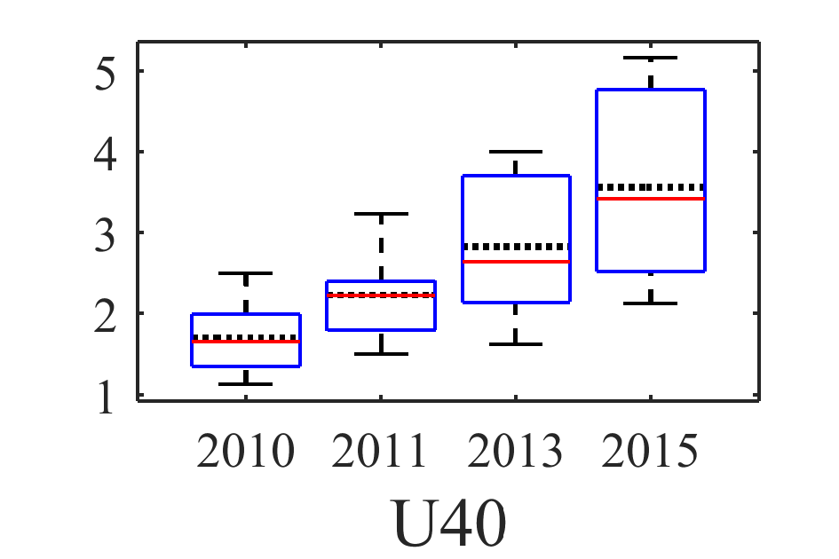
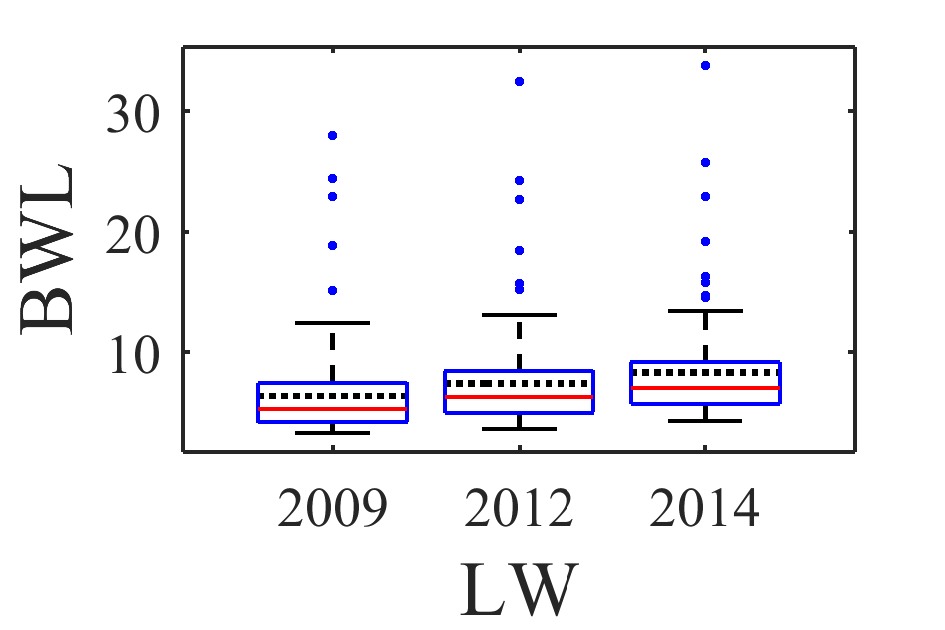
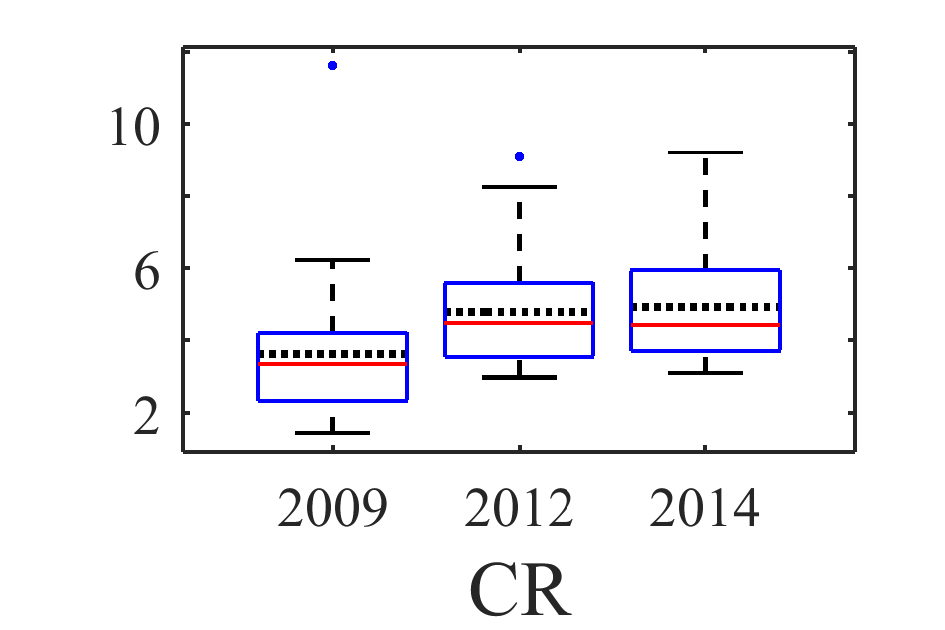
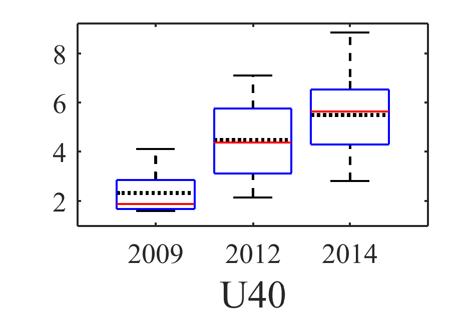

[](http://quantlet.de/)

## [](http://quantlet.de/) **ARRboxhb** [](http://quantlet.de/)

```yaml

Name of QuantLet : ARRboxhb

Published in : ARR - Academic Rankings Research

Description : 'Creates boxplots of the selected VWL and BWL Handelsblatt (HB) rankings (Lifework
(LW), Current research (CR), Under 40 (U40))'

Keywords : 'plot, correlation, dependence, multivariate, multivariate analysis, visualization, data
visualization, analysis, descriptive-methods, descriptive, graphical representation, boxplot,
descriptive-statistics, five number summary'

See also : 'ARRboxage, ARRboxgscit, ARRcormer, ARRdenmer2d, ARRdenmer3d, ARRhexage, ARRhexcit,
ARRhexhin, ARRhismer, ARRmosage, ARRmosagegr, ARRmossub, ARRpcpgscit, ARRpcphb, ARRpcpmer,
ARRpcprp, ARRqrqqhb, ARRscaage, ARRscamer'

Author : Alona Zharova

Submitted : Sat, April 30 2016 by Alona Zharova, Marius Sterling

Datafile : 'ARRdata.dat - The data set contains different researcher (3218 rows) of either RePEc
(77 columns), Handelsblatt (48 columns) ranking or both and their Google Scholar data (16 columns)
as well as age and subject fields (2 columns)'

Output : 'Boxplots for ranking scores of researchers within HB VWL sub-rankings (LW - 158
observations, CR - 28, U40 - 16; from 2010 to 2015) and HB BWL sub-rankings (LW - 128 observations,
CR - 37, U40 - 12; from 2009 to 2014). The red lines denote the median, whereas the dotted lines
display the mean.'

```









### MATLAB Code:
```matlab
%% Clearing all variables
clear all; clc;
%% Image settings
fonttype      = 'Times New Roman';
fontsize      = 14;
fontsize_axes = 10;
papersize     = [6 4];
%% Data input
merge = readtable('ARRdata.dat','Delimiter',';');
%% Function for data selection
substrmatch  = @(x,y) ~cellfun(@isempty,strfind(y,x));
findmatching = @(x,y) y(substrmatch(x,y));
%% Data selection
x        = sort(findmatching('hb_vwl',findmatching('lw_score',merge.Properties.VariableNames)));
x        = x(2:4); % due to the fact that there are no scores for LW VWL2010 we need to neglect these
TF       = ismissing(merge(:,x));
z1       = table2array(merge(~any(TF,2),x));
%% Setting label names
xlabel   = 'LW';
ylabel   = 'VWL';
label    = {'2011','2013','2015'};
%% Naming boxplot
filename = 'ARRboxhb_VWL_LW';
%% Function for boxplot (to be saved in a separate Matlab file in the same folder)
% function ARRboxfun(z2,papersize,label,fontsize,fontsize_axes,fonttype,filename,x_label,y_label)
% % creating the figure
% figure1 = figure('Visible','off','PaperPosition',[0 0 papersize],'PaperSize',papersize);
%    % calculating the means
%     m=mean(z2);
%     hold on;
%     % plotting the means
%     for l_i = 1:size(z2,2)
%         a   = 0.6+l_i-1;
%         b   = 1.4+l_i-1;
%         line([a b],[m(l_i) m(l_i)],'Color','k','LineStyle',':','LineWidth',1.2);
%     end
%     % boxplots
%     boxplot([z2],'Symbol','.','labels',label,'widths',0.8)
%     % setting labels
%     set(gca,'FontSize',fontsize_axes,'FontName',fonttype);
%     xlabel(x_label,'FontSize',fontsize,'FontName',fonttype);
%     ylabel(y_label,'FontSize',fontsize,'FontName',fonttype);
%     hold off
%     set(figure1,'Position',[0 0 1 1]);
% % creating the image (png)
% print(figure1,'-dpng','-r400',filename);
% end
%% Creating image
ARRboxfun(z1,papersize,label,fontsize,fontsize_axes,fonttype,filename,xlabel,ylabel)
%% VWL CR
x        = sort(findmatching('hb_vwl',findmatching('cr_score',merge.Properties.VariableNames)));
TF       = ismissing(merge(:,x));
z2       = table2array(merge(~any(TF,2),x));
xlabel   ='CR';
label    = {'2010','2011','2013','2015'};
filename = 'ARRboxhb_VWL_CR';
ylabel   = ' ';
ARRboxfun(z2,papersize,label,fontsize,fontsize_axes,fonttype,filename,xlabel,ylabel)
%% VWL U40
x        = sort(findmatching('hb_vwl',findmatching('u40_score',merge.Properties.VariableNames)));
TF       = ismissing(merge(:,x));
z3       = table2array(merge(~any(TF,2),x));
xlabel   = 'U40';
label    = {'2010','2011','2013','2015'};
filename = 'ARRboxhb_VWL_U40';
ylabel   = ' ';
ARRboxfun(z3,papersize,label,fontsize,fontsize_axes,fonttype,filename,xlabel,ylabel)
%% BWL LW
x        = sort(findmatching('hb_bwl',findmatching('lw_score',merge.Properties.VariableNames)));
TF       = ismissing(merge(:,x));
z4       = table2array(merge(~any(TF,2),x));
xlabel   = 'LW';
label    = {'2009','2012','2014'};
filename = 'ARRboxhb_BWL_LW';
ylabel   = 'BWL';
ARRboxfun(z4,papersize,label,fontsize,fontsize_axes,fonttype,filename,xlabel,ylabel)
%% BWL CR
x        = sort(findmatching('hb_bwl',findmatching('cr_score',merge.Properties.VariableNames)));
TF       = ismissing(merge(:,x));
z5       = table2array(merge(~any(TF,2),x));
xlabel   = 'CR';
label    = {'2009','2012','2014'};
filename = 'ARRboxhb_BWL_CR';
ylabel   = ' ';
ARRboxfun(z5,papersize,label,fontsize,fontsize_axes,fonttype,filename,xlabel,ylabel)
%% BWL U40
x        = sort(findmatching('hb_bwl',findmatching('u40_score',merge.Properties.VariableNames)));
TF       = ismissing(merge(:,x));
z6       = table2array(merge(~any(TF,2),x));
xlabel   = 'U40';
label    = {'2009','2012','2014'};
filename = 'ARRboxhb_BWL_U40';
ylabel   = ' ';
ARRboxfun(z6,papersize,label,fontsize,fontsize_axes,fonttype,filename,xlabel,ylabel)

```
