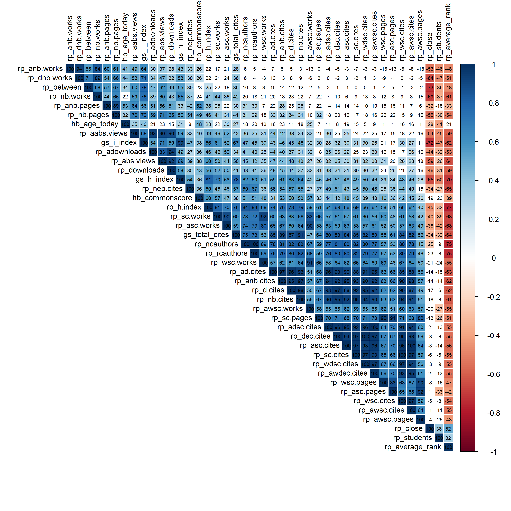

[](http://quantlet.de/)

## [](http://quantlet.de/) **ARRcormer** [](http://quantlet.de/)

```yaml

Name of QuantLet : ARRcormer

Published in : ARR - Academic Rankings Research

Description : 'Plots linear correlation between 42 score values of Handelsblatt (HB), RePEc (RP)
and Google Scholar (GS) rankings in an upper triangular matrix. The values are clustered.'

Keywords : 'plot, correlation, correlation-matrix, dependence, multivariate, multivariate analysis,
visualization, data visualization, analysis, descriptive-methods, descriptive, graphical
representation, dependence'

See also : 'ARRboxage, ARRboxgscit, ARRboxhb, ARRdenmer2d, ARRdenmer3d, ARRhexage, ARRhexcit,
ARRhexhin, ARRhismer, ARRmosage, ARRmosagegr, ARRmossub, ARRpcpgscit, ARRpcphb, ARRpcpmer,
ARRpcprp, ARRqrqqhb, ARRscaage, ARRscamer'

Author : Alona Zharova

Submitted : Sat, April 30 2016 by Alona Zharova, Marius Sterling

Datafile : 'ARRdata.dat - The data set contains different researcher (3218 rows) of either RePEc
(77 columns), Handelsblatt (48 columns) ranking or both and their Google Scholar data (16 columns)
as well as age and subject fields (2 columns)'

Output : 'Correlation matrix of 42 factors of HB, RP and GS for 84 researchers in December 2015.
The color depicts the strength of correlation: from positive (blue) to negative (red).'

```




### R Code:
```r
# clear istory
rm(list = ls(all = TRUE))
graphics.off()
# settings
font = "Times"
res  = 300

# activating required packages, if they are not installed they first get
# installed
libraries = c("corrplot")
lapply(libraries, function(x) if (!(x %in% installed.packages())) {install.packages(x)})
lapply(libraries, library, quietly = TRUE, character.only = TRUE)

# data input and selection of all score values (no rankings)
data  = read.csv2("ARRdata.csv", sep = ";", dec = ",", header = T, stringsAsFactors = FALSE)
data  = data[!is.na(data$hb_commonscore) & !is.na(data$rp_author) & !is.na(data$gs_author),]
data2 = data[, grepl(pattern = "hb_age_today|hb_commonscore", x = colnames(data)) | 
  (grepl(pattern = "rp_", x = colnames(data)) & grepl(pattern = "score", x = colnames(data))) | 
  (grepl(pattern = "gs_total_cites|gs_h_index|gs_i_index", x = colnames(data)))]
x = data2
colnames(x) = gsub(pattern = "_score", replacement = "", x = colnames(x))

# computing the correlation matrix
mcor = cor(x, method = c("pearson"), use = "pairwise.complete.obs")  # 'pearson', 'kendall', 'spearman'

# plot of the correlation matrix
png(file = "ARRcormer.png", width = 10, height = 10, units="in",res=res, family = font, pointsize = 7)
corrplot(mcor, order = "AOE", method = "color", type = "upper", tl.col = "black", 
  cl.cex = 1.5, tl.cex = 1.5, addCoef.col = "black", addCoef.cex = 1, addCoefasPercent = TRUE, 
  p.mat = 1 - abs(mcor), sig.level = 0.75, insig = "blank")
dev.off()
# type=upper: upper triangular matrix!  order: 'orignial'= as is in the matrix,
# order='AOE' for the angular order of the eigenvectors. 

```
