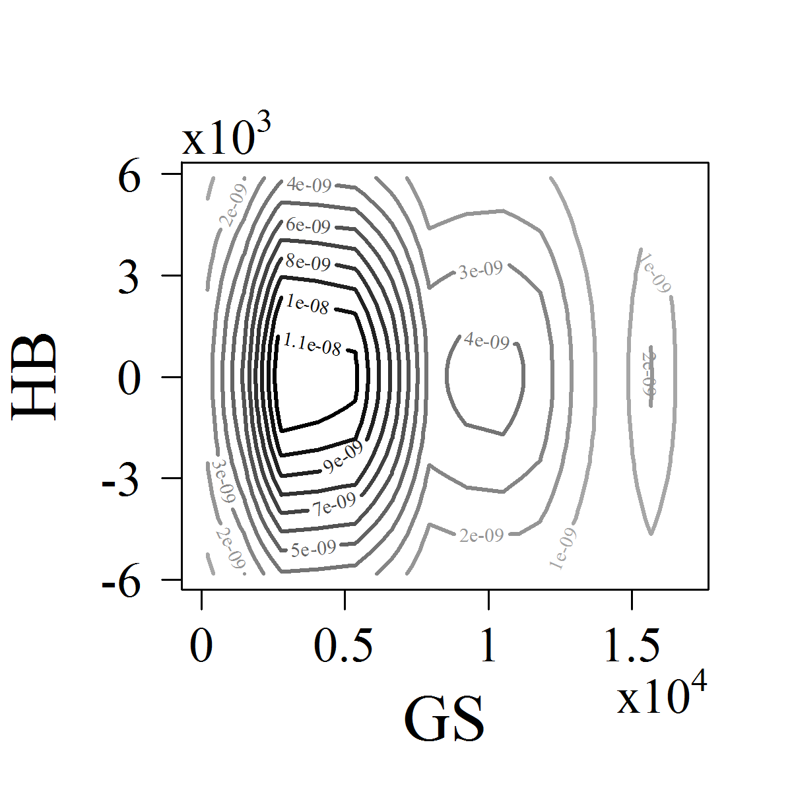
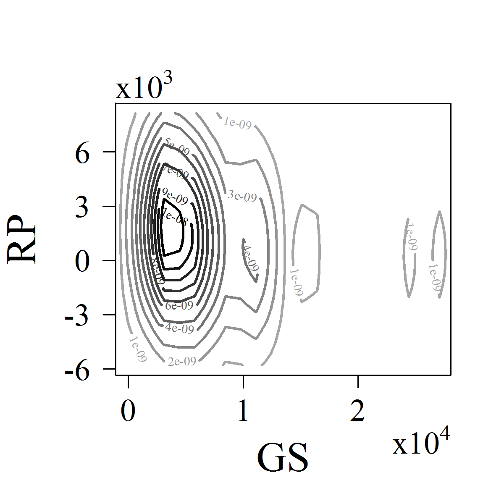
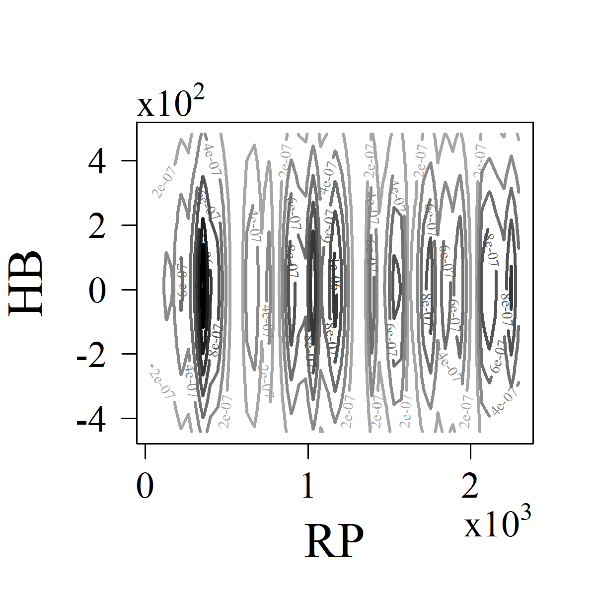

[](http://quantlet.de/)

## [](http://quantlet.de/) **ARRdenmer2d** [](http://quantlet.de/)

```yaml

Name of QuantLet : ARRdenmer2d

Published in : ARR - Academic Rankings Research

Description : 'Plots contour plots of the 2 dimensional kernel density estimates of the main scores
(HB, GS and RP) versus each other.'

Keywords : 'plot, kernel, multivariate, visualization, data visualization, analysis, descriptive,
graphical representation, distribution'

See also : 'ARRboxage, ARRboxgscit, ARRboxhb, ARRcormer, ARRdenmer3d, ARRhexage, ARRhexcit,
ARRhexhin, ARRhismer, ARRmosage, ARRmosagegr, ARRmossub, ARRpcpgscit, ARRpcphb, ARRpcpmer,
ARRpcprp, ARRqrqqhb, ARRscaage, ARRscamer'

Author : Alona Zharova

Submitted : Sat, April 30 2016 by Alona Zharova, Marius Sterling

Datafile : 'ARRdata.csv - The data set contains different researcher (3218 rows) of either RePEc
(77 columns), Handelsblatt (48 columns) ranking or both and their Google Scholar data (16 columns)
as well as age and subject fields (2 columns)'

Output : 'Contour plots of the kernel density of HB and GS (left), GS and RP (center), as well as
HB and RP (right). The contour lines indicate the height of the density. Here the data of 84
researchers from 2015 is analyzed.'

```








### R Code:
```r

# Clear cache and close windows
rm(list=ls(all=TRUE))
graphics.off()

# install required packages
libraries = c("KernSmooth","graphics")
lapply(libraries, function(x) if (!(x %in% installed.packages())) {install.packages(x)})
lapply(libraries, library, quietly = TRUE, character.only = TRUE)

# image settings
font     = "serif" # font Times
res      = 300
cex.lab  = 2
cex.axis = 1.5

# Data input
data = read.csv2("ARRdata.csv",sep=";",dec=",",header = T,stringsAsFactors = FALSE)
data = data[!is.na(data$hb_commonscore)&!is.na(data$rp_author)&!is.na(data$gs_author),]

# Data selection
rphb0 = grep(pattern="hb_commonscore|rp_rank", x = colnames(data))
rphb  = data[,rphb0]
gshb0 = grep(pattern="hb_commonscore|gs_total_cites", x = colnames(data))
gshb  = data[,gshb0]
rpgs0 = grep(pattern="rp_rank|gs_total_cites", x = colnames(data))
rpgs  = data[,rpgs0]

# Color function
cfrom = c(0.65,0.65,0.65)
cto   = c(0,0,0)
color_fun = function(n){
  tmp = t(cfrom+(as.vector((cto-cfrom)/(n-1)))%*%t(as.vector(0:(n-1))))
  return(rgb(tmp[,1],tmp[,2],tmp[,3]))
}

# RP & HB
# Computation of the kernel
d1  = bkde2D(rphb[,1:2], bandwidth = 1.06 * c(sd(rphb[,2]), sd(rphb[,1]) * 84^(-1/5)))
# Creating images
png(file = "ARRdenmer2drphb.png", width = 4, height = 4, units = "in", res = res, family = font)
  par(mar = c(5, 4.5, 4, 2) + 0.1, cex.lab = cex.lab, cex.axis = cex.axis, las = 1)
  nlevels = 7
  contour(x = d1$x1, y = d1$x2, d1$fhat, xlab = "RP", ylab = "HB", axes = F, nlevels = nlevels, 
          col = c(rep("red", times = 1), color_fun(n = nlevels)), lwd = 2)
  # Axes and Axes ticks
  ax = c(-3:3) * 2
  axis(2, at = ax * 10^2, labels = ax, cex.axis = cex.axis)
  mtext(expression(displaystyle(x) * 10^2), adj = 0, padj = 0, outer = FALSE, cex = cex.axis)
  # mtext writes a text on the margin of the image, here x10^2
  ax = c(0:3)
  axis(1, at = ax * 10^3, labels = ax, cex.axis = cex.axis)
  mtext(expression(displaystyle(x) * 10^3), side = 1, adj = 1, padj = 2, outer = FALSE, 
        cex = cex.axis)
  box(lwd = 1)
dev.off()

d2 = bkde2D(gshb[, 1:2], bandwidth = 1.06 * c(sd(gshb[, 2]), sd(gshb[, 1]) * 84^(-1/5)))
png(file = "ARRdenmer2dgshb.png", width = 4, height = 4, units = "in", res = res, 
    family = font)
  par(mar = c(5, 4.5, 4, 2) + 0.1, cex.lab = cex.lab, cex.axis = cex.axis, las = 1)
  nlevels = 9
  contour(d2$x1, d2$x2, d2$fhat, xlab = "GS", ylab = "HB", xlim = c(0, 17000), axes = F, 
          nlevels = nlevels, col = c(rep("red", times = 1), color_fun(n = nlevels + 2)), 
          lwd = 2)
  ax = c(-3:3) * 3
  axis(2, at = ax * 10^3, labels = ax, cex.axis = cex.axis)
  mtext(expression(displaystyle(x) * 10^3), adj = 0, padj = 0, outer = FALSE, cex = cex.axis)
  ax = c(0:3) * 0.5
  axis(1, at = ax * 10^4, labels = ax, cex.axis = cex.axis)
  mtext(expression(displaystyle(x) * 10^4), side = 1, adj = 1, padj = 2, outer = FALSE, 
        cex = cex.axis)
  box(lwd = 1)
dev.off()

# RP & GS
d3 = bkde2D(rpgs[, 2:1], bandwidth = 1.06 * c(sd(rpgs[, 1]), sd(rpgs[, 2]) * 84^(-1/5)))
png(file = "ARRdenmer2drpgs.png", width = 4, height = 4, units = "in", res = res, 
    family = font)
  par(mar = c(5, 4.5, 4, 2) + 0.1, cex.lab = cex.lab, cex.axis = cex.axis, las = 1)
  nlevels = 9
  contour(d3$x1, d3$x2, d3$fhat, nlevels = nlevels, xlab = "GS", ylab = "RP", xlim = c(0, 
                                                                                       27000), axes = F, col = c(rep("red", times = 1), color_fun(n = nlevels + 2)), 
          lwd = 2)
  ax = c(-3:3) * 3
  axis(2, at = ax * 10^3, labels = ax, cex.axis = cex.axis)
  mtext(expression(displaystyle(x) * 10^3), adj = 0, padj = 0, outer = FALSE, cex = cex.axis)
  ax = c(0:3)
  axis(1, at = ax * 10^4, labels = ax, cex.axis = cex.axis)
  mtext(expression(displaystyle(x) * 10^4), side = 1, adj = 1, padj = 2, outer = FALSE, 
        cex = cex.axis)
  box(lwd = 1)
dev.off() 

```
