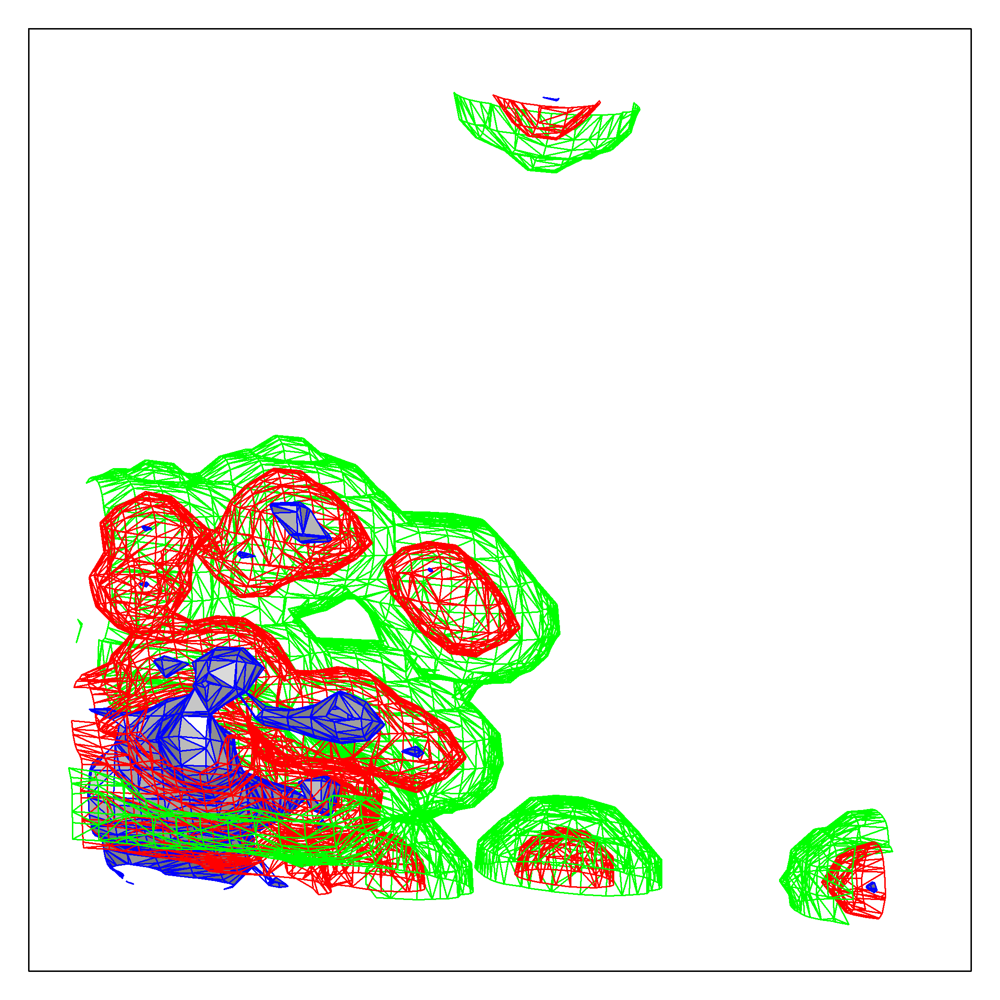

[](http://quantlet.de/)

## [](http://quantlet.de/) **ARRdenmer3d** [](http://quantlet.de/)

```yaml

Name of QuantLet : ARRdenmer3d

Published in : ARR - Academic Rankings Research

Description : Plots a 3 dimensional kernel density estimate of the main scores (of HB, GS and RP).

Keywords : 'plot, kernel, multivariate, visualization, data visualization, analysis, descriptive,
graphical representation, distribution'

See also : 'ARRboxage, ARRboxgscit, ARRboxhb, ARRcormer, ARRdenmer2d, ARRhexage, ARRhexcit,
ARRhexhin, ARRhismer, ARRmosage, ARRmosagegr, ARRmossub, ARRpcpgscit, ARRpcphb, ARRpcpmer,
ARRpcprp, ARRqrqqhb, ARRscaage, ARRscamer'

Author : Alona Zharova

Submitted : Sat, April 30 2016 by Alona Zharova, Marius Sterling

Datafile : 'ARRdata.csv - The data set contains different researcher (3218 rows) of either RePEc
(77 columns), Handelsblatt (48 columns) ranking or both and their Google Scholar data (16 columns)
as well as age and subject fields (2 columns)'

Output : 'Contour plot of the kernel density estimate of HB, RP and GS at three different levels of
the density: 0.001 (green), 0.1 (red) and 0.75 (blue). Here the data of 84 researchers from 2015 is
analyzed'

```




### R Code:
```r

# clear cache and close windows
rm(list=ls(all=TRUE))
graphics.off()

# install required packages
libraries = c("KernSmooth","misc3d")
lapply(libraries, function(x) if (!(x %in% installed.packages())) {install.packages(x)})
lapply(libraries, library, quietly = TRUE, character.only = TRUE)

# image settings
res  = 300
# data input
data = read.csv2("ARRdata.csv",sep=";",dec=",",header = T,stringsAsFactors = FALSE)
data = data[!is.na(data$hb_commonscore)&!is.na(data$rp_author)&!is.na(data$gs_author),]
# Computing Kernel
d    = kde3d(data$hb_commonscore, data$rp_rank, data$gs_total_cites, n = 30)

png(file = "ARRdenmer3d.png", width = 7, height = 7, units = "in", res = res)
par(mar = c(1, 1, 1, 1))
contour3d(d$d, level = c(max(d$d[10, 10, ]) * 0.001, max(d$d[10, 10, ]) * 0.1, 
                         max(d$d[10, 10, ]) * 0.75), fill = c(FALSE, FALSE, TRUE),
          col.mesh = c("green", "red", "blue"), engine = "standard", 
          screen = list(z = 40, x = -95, y = -45), scale = TRUE)
# level: levels at which to construct contour surfaces fill: filled surfaces
# col.mesh: color to use for the surfaces/ wire frame
box(lwd = 1)
dev.off() 
```
