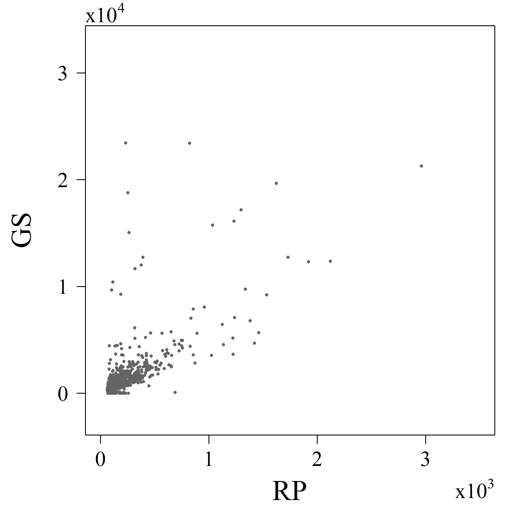
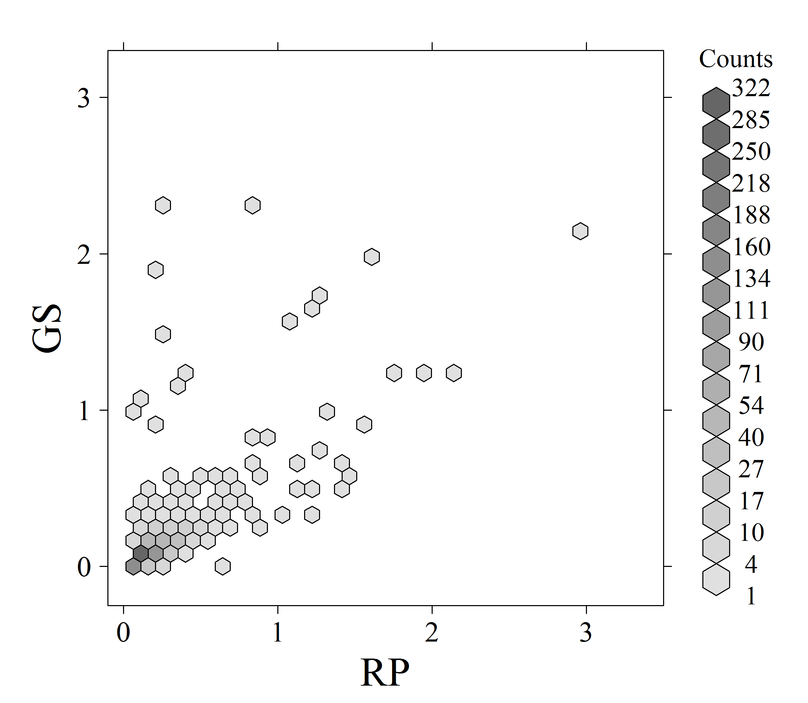

[](http://quantlet.de/)

## [](http://quantlet.de/) **ARRhexcit** [](http://quantlet.de/)

```yaml

Name of QuantLet : ARRhexcit

Published in : ARR - Academic Rankings Research

Description : 'Produces scatter and hexagon plots between the number of citations listed in RePEc
(RP) and Google Scholar (GS) rankings'

Keywords : 'plot, hexagon-plot, scatterplot, analysis, multivariate analysis, multivariate,
visualization, data visualization, counts, dependence, descriptive-methods, correlation,
correlation-matrix, descriptive, graphical representation'

See also : 'ARRboxage, ARRboxgscit, ARRboxhb, ARRcormer, ARRdenmer2d, ARRdenmer3d, ARRhexage,
ARRhexhin, ARRhismer, ARRmosage, ARRmosagegr, ARRmossub, ARRpcpgscit, ARRpcphb, ARRpcpmer,
ARRpcprp, ARRqrqqhb, ARRscaage, ARRscamer'

Author : Alona Zharova

Submitted : Sat, April 30 2016 by Alona Zharova, Marius Sterling

Datafile : 'ARRdata.csv - The data set contains different researcher (3218 rows) of either RePEc
(77 columns), Handelsblatt (48 columns) ranking or both and their Google Scholar data (16 columns)
as well as age and subject fields (2 columns)'

Output : 'Scatterplot (left) and hexagon plot (right) of RP and GS citations for 1024 researchers
in December 2015. Correlation coefficient equals to 0.70'

```





### R Code:
```r

# clear graphics and data
graphics.off()
rm(list = ls(all = TRUE))

# library 
libraries = c("hexbin")
lapply(libraries,function(x)if(!(x %in% installed.packages())){install.packages(x)})
lapply(libraries,library,quietly=TRUE,character.only=TRUE)


# setting (font, color) for paper or presentation output, depending on choice: pub="paper" or pub="presentation"
color                = 100 # color of symbols and hexagon, value between 1 (black) and 254 (white)
font                 = "serif" # Font Times
res                  = 300

#scatterplot
cex                  = 0.5 # size of plot symbol
cex_lab              = 2 # size of label symbols
cex_axis             = 1.5 # size of axes label symbols
cex_main             = 2 # size of main label symbols

#hexbinplot
label.size.main_axis = 2 # size of label symbols
label.size.support   = 1.25 # size of axes label symbols
col.from             = 0.2 # shading from this percentage on (number between 0 and 1)

# data input and selection of RP and GS total citation numbers
data  = read.csv2("ARRdata.csv", sep = ";", dec = ",", header = T, stringsAsFactors = FALSE)
data1 = data[!is.na(data$rp_nb.cites_score) & !is.na(data$gs_total_cites), c("rp_nb.cites_score","gs_total_cites")]
# saving image as png named "ARRhexcit"
png(file = "ARRhexcitscat.png", width = 6, height = 6, units = "in", res = res, family = font)
  par(cex.lab = cex_lab, cex.axis = cex_axis, cex.main = cex_main, las = 1, pty = "s", 
      mar = c(4, 5, 1, 1))
  # las=1: horizontal tick labels pty='s': squared plotting region
  # x-y-plot with number of Cites of RePEc and GS
  plot(data1$rp_nb.cites_score/10^4, data1$gs_total_cites/10^5, xlab = "RP", xlim = c(0,3.5),
       ylab = "GS", ylim = c(-0.25, 3.3), pch = 16, col = rgb(color, color, color,alpha = 254, maxColorValue = 255),
       cex = cex, axes = F)
  # writing axes transformation (multiplication with 10^x)
  mtext(expression(displaystyle(x) * 10^4), adj = 0, padj = 0, outer = FALSE, cex = cex_axis)
  mtext(expression(displaystyle(x) * 10^3), side = 1, adj = 1, padj = 2.5, outer = FALSE, 
        cex = cex_axis)
  # axes
  ax = (0:3)
  axis(1, at = ax, labels = ax, cex.axis = cex_axis)
  axis(2, at = ax, labels = ax, cex.axis = cex_axis)
  box()
dev.off()


png(file = "ARRhexcitbin.png", width = 7.75, height = 6.75, units = "in", res = res, 
    family = font)
# hexbin plot
  hexbinplot(data1$gs_total_cites/10^5 ~ data1$rp_nb.cites_score/10^4, 
             xlab = list(label = "RP",cex = label.size.main_axis + 0.35), xlim = c(-0.1, 3.5), 
             ylab = list(label = "GS",cex = label.size.main_axis + 0.35), ylim = c(-0.25, 3.3), 
             style = "colorscale", border = TRUE, aspect = 1, trans = sqrt, inv = function(ages) ages^2, 
             scales = list(cex = label.size.support + 0.4), cex.labels = label.size.support + 0.25, 
             cex.title = label.size.support + 0.25, colramp = function(n) {
               rgb(1, 1, 1, alpha = seq(from = col.from, to = 0.999, length = n) * (255 - color),
                   maxColorValue = 255)
               })
  # style: string specifying the style of hexagon plot, see 'grid.hexagons' for the
  # possibilities!  border=TRUE: frame around the hexagons!  trans: specifying a
  # transformation for the counts such as sqrt!  inv: the inverse transformation of
  # trans!  color of hexagon depends on count it represents as greater counts as
  # darker!
dev.off() 
```
