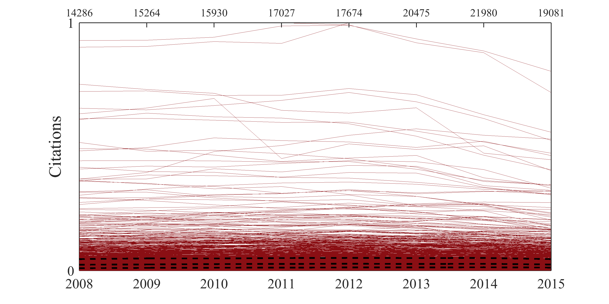

[](http://quantlet.de/)

## [](http://quantlet.de/) **ARRpcpgscit** [](http://quantlet.de/)

```yaml

Name of QuantLet : ARRpcpgscit

Published in : ARR - Academic Rankings Research

Description : 'Creates a parallel coordinates plot for GS citation for the period from 2008 till
2015 with quartiles'

Keywords : 'plot, correlation, correlation matrix, dependence, multivariate, multivariate analysis,
visualization, data visualization, analysis, descriptive-methods, descriptive, graphical
representation, descriptive-statistics, parallel-coordinates-plots, quantile'

See also : 'ARRboxage, ARRboxgscit, ARRboxhb, ARRcormer, ARRdenmer2d, ARRdenmer3d, ARRhexage,
ARRhexcit, ARRhexhin, ARRhismer, ARRmosage, ARRmosagegr, ARRmossub, ARRpcphb, ARRpcpmer, ARRpcprp,
ARRqrqqhb, ARRscaage, ARRscamer'

Author : Alona Zharova

Submitted : Sat, April 30 2016 by Alona Zharova, Marius Sterling

Datafile : 'ARRdata.dat - The data set contains different researcher (3218 rows) of either RePEc
(77 columns), Handelsblatt (48 columns) ranking or both and their Google Scholar data (16 columns)
as well as age and subject fields (2 columns)'

Output : 'Parallel coordinates plot for standardized GS citations (y-axis) from 2008 to 2015 for
selected 1357 researchers. Upper x-axis numbers show the maximum number of citations for the
corresponding year'

```




### MATLAB Code:
```matlab
%% Clearing all variables
clear all; clc;
%% Figure settings
fonttype           = 'Times New Roman';
fontsize           = 16;
fontsize_axes      = 13;
fontsize_axes_top  = 10;
papersize          = [20 10];
quantile_linewidth = 1.4;

% data input
merge = readtable('ARRdata.dat','Delimiter',';');
% selecting the Google Scholar citations over 2007 till 2014
substrmatch  = @(x,y) ~cellfun(@isempty,strfind(y,x));
findmatching = @(x,y) y(substrmatch(x,y));
x            = sort(findmatching('gs_citation_20',merge.Properties.VariableNames));
x            = x(2:size(x,2));
%% Data selecting (GS citations over 2008 till 2015)
TF           = ismissing(merge(:,x));
z            = table2array(merge(~any(TF,2),x));
%% Standardizing of values
y            = (z-(ones(size(z,1),1)*min(z)))./(ones(size(z,1),1)*(max(z)-min(z)+(max(z)==min(z))));
label        = {'2008','2009','2010','2011','2012','2013','2014','2015'};
y            = y(~(y(:,4)>0.5&y(:,5)<0.5),:);
%% Creating figure
figure1 = figure('Visible','on','PaperPosition',[0 0 papersize],'PaperSize',papersize);
parallelcoords(y,'linewidth',0.01,'label', label,'Color',[138/255 15/255 20/255])
    set(gca,'FontSize',fontsize_axes,'FontName',fonttype,'YTickLabel',{'0','1'},'YTick',[0 1]);
    ylabel('Citations','FontSize',fontsize,'FontName',fonttype);
    % computing and ploting of quartiles 
    y2=quantile(y,[0.25 0.5 0.75]);
    line(1:length(label),transpose(y2),'linewidth',quantile_linewidth,'Color','k','LineStyle','--');
    box on;
    % creating a second x-axes on top of the plot where the maximum values are noted
    ax1 = gca;
    ax2 = axes('Position',ax1.Position,...
        'FontSize',fontsize_axes_top,...
        'FontName',fonttype,...
        'XAxisLocation','top',...
        'YAxisLocation','right',...
        'XTick',(ax1.XTick-1)/(length(ax1.XTick)-1),...
        'XTickLabel',max(z),...
        'YTick',[],...
        'YTickLabel','',...
        'Color','none');
%% Saving figure
print(figure1,'-dpng','-r400','ARRpcpgscit');
```
