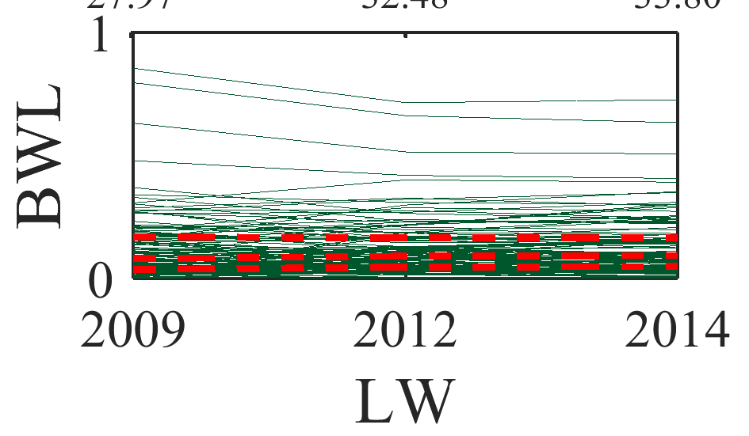
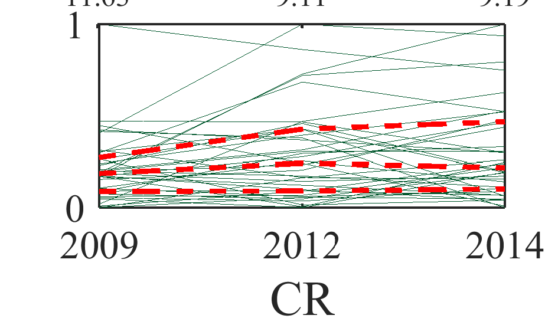
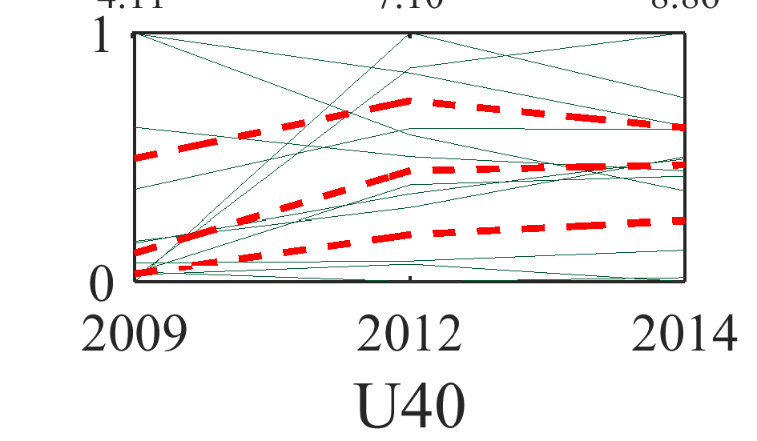
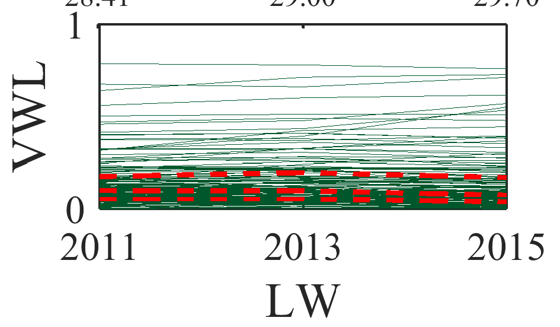
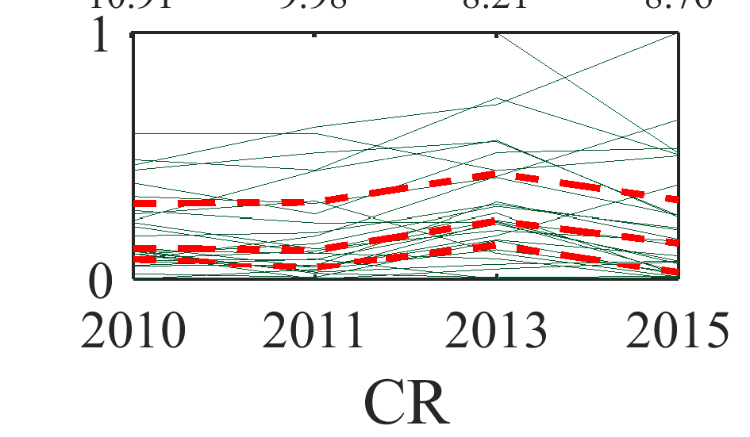
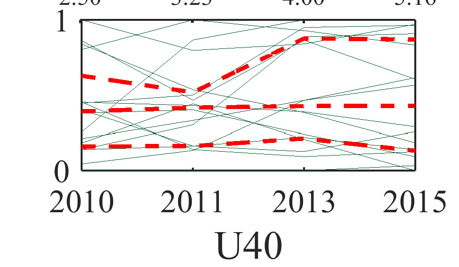

[](http://quantlet.de/)

## [](http://quantlet.de/) **ARRpcphb** [](http://quantlet.de/)

```yaml

Name of QuantLet : ARRpcphb

Published in : ARR - Academic Rankings Research

Description : 'Creates parallel coordinates plots of of the selected VWL and BWL Handelsblatt (HB)
rankings (Lifework (LW), Current research (CR), Under 40 (U40))'

Keywords : 'plot, correlation, correlation matrix, dependence, multivariate, multivariate analysis,
visualization, data visualization, analysis, descriptive-methods, descriptive, graphical
representation, descriptive-statistics, parallel-coordinates-plots, quantile'

See also : 'ARRboxage, ARRboxgscit, ARRboxhb, ARRcormer, ARRdenmer2d, ARRdenmer3d, ARRhexage,
ARRhexcit, ARRhexhin, ARRhismer, ARRmosage, ARRmosagegr, ARRmossub, ARRpcpgscit, ARRpcpmer,
ARRpcprp, ARRqrqqhb, ARRscaage, ARRscamer'

Author : Alona Zharova

Submitted : Sat, April 30 2016 by Alona Zharova, Marius Sterling

Datafile : 'ARRdata.dat - The data set contains different researcher (3218 rows) of either RePEc
(77 columns), Handelsblatt (48 columns) ranking or both and their Google Scholar data (16 columns)
as well as age and subject fields (2 columns)'

Output : 'Parallel coordinates plots for standardized scores (y-axis) of researchers within HB VWL
sub-rankings from 2010 to 2015, as well as HB BWL sub-rankings from 2009 to 2014. Green lines
represent scores of researchers with a specific ranking score for each year. Red dashed lines
denote the three quartiles (25%, 50% and 75%). Upper x-axis numbers show the maximum ranking score
for the corresponding year. Plotted are scores of researchers that are listed in all analyzed
years'

```














### MATLAB Code:
```matlab
%% Clearing all variables
clear all; clc;
%% Image settings
fonttype           = 'Times New Roman';
fontsize           = 15;
fontsize_axes      = 12;
fontsize_axes_top  = 9;
quantile_linewidth = 1.4;
papersize          = [6 4];
margin             = [0 0.5];
%% Data input
merge     = readtable('ARRdata.dat','Delimiter',';');
%% Data selection (here all vwl scores) and standardization onto the [0,1]-interval
TF        = ismissing(merge(:,{'hb_vwl2015_lw_score','hb_vwl2013_lw_score','hb_vwl2011_lw_score'}));
z1        = table2array(merge(~any(TF,2),{'hb_vwl2011_lw_score','hb_vwl2013_lw_score','hb_vwl2015_lw_score'}));
y         = (z1-(ones(size(z1,1),1)*min(z1)))./(ones(size(z1,1),1)*(max(z1)-min(z1)+(max(z1)==min(z1))));
%% Calculation of quartiles
y2        = quantile(y,[0.25 0.5 0.75]);
label     = {'2011','2013','2015'};
figure1   = figure('Visible','off','PaperPosition',[0 0 papersize-margin],'PaperSize',papersize);
    % setting the axis of the line plot
    axes1 = axes('Parent',figure1,...
                 'YTickLabel',{'0','1'},'YTick',[0 1],...
                 'XTickLabel',label,...
                 'XTick',1:length(label),...
                 'FontSize',fontsize_axes,...
                 'FontName',fonttype...
             );
    % drawing the lines over years set in 'label'
    line(1:length(label),y,...
        'Parent',axes1,...
        'Tag','coords',...
        'LineWidth',0.05,...
        'Color',[0 87/255 44/255]);
    % setting the labels of the axis 
    xlabel('LW','FontSize',fontsize,'FontName',fonttype);
    ylabel('VWL','FontSize',fontsize,'FontName',fonttype);
    % plotting the quantiles
    line(1:length(label),transpose(y2),'linewidth',quantile_linewidth,'Color','r','LineStyle','--');
    % image border on
    box on;
%% Adding the maximal values on top of plot
ax1 = gca; 
axes('Position',ax1.Position+[0.045 0 -0.045 0],...
    'FontSize',fontsize_axes_top,...
    'FontName',fonttype,...
    'XAxisLocation','top',...
    'YAxisLocation','right',...
    'XTick',(ax1.XTick-min(ax1.XTick))/(max(ax1.XTick)-min(ax1.XTick)),...
    'XTickLabel',arrayfun(@(v) sprintf('%0.2f',v), max(z1), 'UniformOutput', false),...
    'YColor','none',...
    'Color','none');

TF        = ismissing(merge(:,{'hb_vwl2015_cr_score','hb_vwl2013_cr_score','hb_vwl2011_cr_score','hb_vwl2010_cr_score'}));
z2        = table2array(merge(~any(TF,2),sort({'hb_vwl2010_cr_score','hb_vwl2011_cr_score','hb_vwl2013_cr_score','hb_vwl2015_cr_score'})));
y         = (z2-(ones(size(z2,1),1)*min(z2)))./(ones(size(z2,1),1)*(max(z2)-min(z2)+(max(z2)==min(z2))));
y2        = quantile(y,[0.25 0.5 0.75]);
label     = {'2010','2011','2013','2015'};
figure2   = figure('Visible','off','PaperPosition',[0 0 papersize-margin],'PaperSize',papersize);
    axes1 = axes('Parent',figure2,...
                 'YTickLabel',{'0','1'},'YTick',[0 1],...
                 'XTickLabel',label,...
                 'XTick',1:length(label),...%[1 2]...
                 'FontSize',fontsize_axes,...
                 'FontName',fonttype...
             );
    line(1:length(label),y,...
        'Parent',axes1,...
        'Tag','coords',...
        'LineWidth',0.05,...
        'Color',[0 87/255 44/255]);
    xlabel('CR','FontSize',fontsize,'FontName',fonttype);
    ylabel(' ','FontSize',fontsize,'FontName',fonttype);
    line(1:length(label),transpose(y2),'linewidth',quantile_linewidth,'Color','r','LineStyle','--');
    box on;
ax2 = gca;
axes('Position',ax2.Position+[0.045 0 -0.045 0],...
    'FontSize',fontsize_axes_top,...
    'FontName',fonttype,...
    'XAxisLocation','top',...
    'YAxisLocation','right',...
    'XTick',(ax2.XTick-1)/max(ax2.XTick-1),...
    'XTickLabel',arrayfun(@(v) sprintf('%0.2f',v), max(z2), 'UniformOutput', false),...
    'YColor','none',...
    'Color','none');

TF        = ismissing(merge(:,{'hb_vwl2015_u40_score','hb_vwl2013_u40_score','hb_vwl2011_u40_score','hb_vwl2010_u40_score'}));
z3        = table2array(merge(~any(TF,2),sort({'hb_vwl2015_u40_score','hb_vwl2013_u40_score','hb_vwl2011_u40_score','hb_vwl2010_u40_score'})));
y         = (z3-(ones(size(z3,1),1)*min(z3)))./(ones(size(z3,1),1)*(max(z3)-min(z3)+(max(z3)==min(z3))));
y2        = quantile(y,[0.25 0.5 0.75]);
label     = {'2010','2011','2013','2015'}; 
figure3   = figure('Visible','off','PaperPosition',[0 0 papersize-margin],'PaperSize',papersize);
    axes1 = axes('Parent',figure3,...
                 'YTickLabel',{'0','1'},'YTick',[0 1],...
                 'XTickLabel',label,...
                 'XTick',(1:length(label))-1,...%[1 2]...
                 'FontSize',fontsize_axes,...
                 'FontName',fonttype...
             );
    line((1:length(label))-1,y,...
        'Parent',axes1,...
        'Tag','coords',...
        'LineWidth',0.05,...
        'Color',[0 87/255 44/255]);
    xlabel('U40','FontSize',fontsize,'FontName',fonttype);
    ylabel(' ','FontSize',fontsize,'FontName',fonttype);
    line((1:length(label))-1,transpose(y2),'linewidth',quantile_linewidth,'Color','r','LineStyle','--');
    box on;
ax3 = gca;
axes('Position',ax3.Position+[0.045 0 -0.045 0],...
    'FontSize',fontsize_axes_top,...
    'FontName',fonttype,...
    'XAxisLocation','top',...
    'YAxisLocation','right',...
    'XTick',(ax3.XTick-min(ax3.XTick))/(max(ax3.XTick)-min(ax3.XTick)),...
    'XTickLabel',arrayfun(@(v) sprintf('%0.2f',v), max(z3), 'UniformOutput', false),...
    'YColor','none',...
    'Color','none');

TF        = ismissing(merge(:,{'hb_bwl2014_lw_score','hb_bwl2012_lw_score','hb_bwl2009_lw_score'}));
z4        = table2array(merge(~any(TF,2),sort({'hb_bwl2014_lw_score','hb_bwl2012_lw_score','hb_bwl2009_lw_score'})));
y         = (z4-(ones(size(z4,1),1)*min(z4)))./(ones(size(z4,1),1)*(max(z4)-min(z4)+(max(z4)==min(z4))));
y2        = quantile(y,[0.25 0.5 0.75]);
label     = {'2009','2012','2014'};
figure4   = figure('Visible','off','PaperPosition',[0 0 papersize-margin],'PaperSize',papersize);
    axes1 = axes('Parent',figure4,...
                 'YTickLabel',{'0','1'},'YTick',[0 1],...
                 'XTickLabel',label,...
                 'XTick',1:length(label),...
                 'FontSize',fontsize_axes,...
                 'FontName',fonttype...
             );
    line(1:length(label),y,...
        'Parent',axes1,...
        'Tag','coords',...
        'LineWidth',0.05,...
        'Color',[0 87/255 44/255]);
    xlabel('LW','FontSize',fontsize,'FontName',fonttype);
    ylabel('BWL','FontSize',fontsize,'FontName',fonttype);
    line(1:length(label),transpose(y2),'linewidth',quantile_linewidth,'Color','r','LineStyle','--');
    box on;
ax4 = gca;
axes('Position',ax4.Position+[0.045 0 -0.045 0],...
    'FontSize',fontsize_axes_top,...
    'FontName',fonttype,...
    'XAxisLocation','top',...
    'YAxisLocation','right',...
    'XTick',(ax4.XTick-1)/max(ax4.XTick-1),...
    'XTickLabel',arrayfun(@(v) sprintf('%0.2f',v), max(z4), 'UniformOutput', false),...
    'YColor','none',...
    'Color','none');


TF        = ismissing(merge(:,{'hb_bwl2014_cr_score','hb_bwl2012_cr_score','hb_bwl2009_cr_score'}));
z5        = table2array(merge(~any(TF,2),sort({'hb_bwl2014_cr_score','hb_bwl2012_cr_score','hb_bwl2009_cr_score'})));
y         = (z5-(ones(size(z5,1),1)*min(z5)))./(ones(size(z5,1),1)*(max(z5)-min(z5)+(max(z5)==min(z5))));
y2        = quantile(y,[0.25 0.5 0.75]);
label     = {'2009','2012','2014'};
figure5   = figure('Visible','off','PaperPosition',[0 0 papersize-margin],'PaperSize',papersize);
    axes1 = axes('Parent',figure5,...
                 'YTickLabel',{'0','1'},'YTick',[0 1],...
                 'XTickLabel',label,...
                 'XTick',1:length(label),...
                 'FontSize',fontsize_axes,...
                 'FontName',fonttype...
             );
    line(1:length(label),y,...
        'Parent',axes1,...
        'Tag','coords',...
        'LineWidth',0.05,...
        'Color',[0 87/255 44/255]);
    ylabel(' ','FontSize',fontsize,'FontName',fonttype);
    xlabel('CR','FontSize',fontsize,'FontName',fonttype);
    line(1:length(label),transpose(y2),'linewidth',quantile_linewidth,'Color','r','LineStyle','--');
    box on;
ax5 = gca;
axes('Position',ax5.Position+[0.045 0 -0.045 0],...
    'FontSize',fontsize_axes_top,...
    'FontName',fonttype,...
    'XAxisLocation','top',...
    'YAxisLocation','right',...
    'XTick',(ax5.XTick-1)/max(ax5.XTick-1),...
    'XTickLabel',arrayfun(@(v) sprintf('%0.2f',v), max(z5), 'UniformOutput', false),...
    'YColor','none',...
    'Color','none');


TF        = ismissing(merge(:,{'hb_bwl2014_u40_score','hb_bwl2012_u40_score','hb_bwl2009_u40_score'}));
z6        = table2array(merge(~any(TF,2),sort({'hb_bwl2014_u40_score','hb_bwl2012_u40_score','hb_bwl2009_u40_score'})));
y         = (z6-(ones(size(z6,1),1)*min(z6)))./(ones(size(z6,1),1)*(max(z6)-min(z6)+(max(z6)==min(z6))));
y2        = quantile(y,[0.25 0.5 0.75]);
label     = {'2009','2012','2014'};
figure6   = figure('Visible','off',...
       'PaperPosition',[0 0 papersize-margin],...
       'PaperSize',papersize);
    axes1 = axes('Parent',figure6,...
                 'YTickLabel',{'0','1'},'YTick',[0 1],...
                 'XTickLabel',label,...
                 'XTick',1:length(label),...
                 'FontSize',fontsize_axes,...
                 'FontName',fonttype...
             );
    box on;
    line(1:length(label),y,...
        'Parent',axes1,...
        'Tag','coords',...
        'LineWidth',0.05,...
        'Color',[0 87/255 44/255]);
    xlabel('U40','FontSize',fontsize,'FontName',fonttype);
    ylabel(' ','FontSize',fontsize,'FontName',fonttype);
    line(1:length(label),transpose(y2),'linewidth',quantile_linewidth,'Color','r','LineStyle','--')
ax6 = gca; 
axes('Position',ax6.Position+[0.045 0 -0.045 0],...
    'FontSize',fontsize_axes_top,...
    'FontName',fonttype,...
    'XAxisLocation','top',...
    'YAxisLocation','right',...
    'XTick',(ax6.XTick-1)/max(ax6.XTick-1),...
    'XTickLabel',arrayfun(@(v) sprintf('%0.2f',v), max(z6), 'UniformOutput', false),...
    'YColor','none',...
    'Color','none');

%% Saving figures
print(figure1,'-dpng','-r400','ARRpcphb_VWL1');
print(figure2,'-dpng','-r400','ARRpcphb_VWL2');
print(figure3,'-dpng','-r400','ARRpcphb_VWL3');
print(figure4,'-dpng','-r400','ARRpcphb_BWL1');
print(figure5,'-dpng','-r400','ARRpcphb_BWL2');
print(figure6,'-dpng','-r400','ARRpcphb_BWL3');
```
