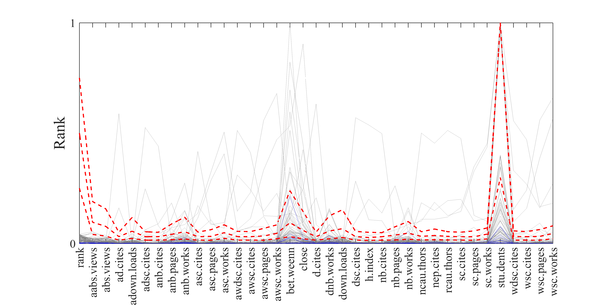
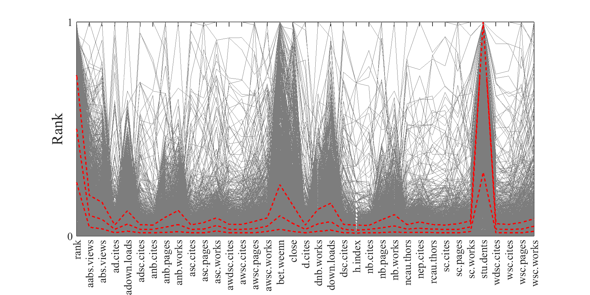

[](http://quantlet.de/)

## [](http://quantlet.de/) **ARRpcprank** [](http://quantlet.de/)

```yaml

Name of QuantLet : ARRpcprank

Published in : ARR - Academic Rankings Research

Description : Creates a parallel coordinates plot of the ranks of all scores of RePEc

Keywords : 'plot, correlation, correlation matrix, dependence, multivariate, multivariate analysis,
visualization, data visualization, analysis, descriptive-methods, descriptive, graphical
representation, descriptive-statistics, parallel-coordinates-plots, quantile'

See also : 'ARRboxage, ARRboxgscit, ARRboxhb, ARRcormer, ARRdenmer2d, ARRdenmer3d, ARRhexage,
ARRhexcit, ARRhexhin, ARRhismer, ARRmosage, ARRmosagegr, ARRmossub, ARRpcpgscit, ARRpcphb,
ARRpcpmer, ARRqrqqhb, ARRscaage, ARRscamer'

Author : Alona Zharova

Submitted : Sat, April 30 2016 by Alona Zharova, Marius Sterling

Datafile : 'ARRdata.dat - The data set contains different researcher (3218 rows) of either RePEc
(77 columns), Handelsblatt (48 columns) ranking or both and their Google Scholar data (16 columns)
as well as age and subject fields (2 columns)'

Output: 
- 1: 'Parallel coordinates plot for RP average rank score and ranks from 36 subrankings for
selected researchers in December 2015. Red lines denote the three quartiles (25%, 50% and 75%)'
- 2: 'Parallel coordinates plot for RP average rank score and ranks from 36 subrankings for
selected researchers in December 2015. The red dashed lines denote three quartiles (25%, 50% and
75%) that are shown for all individuals. Grey lines denote scores of top 100 researchers, while
blue lines indicate scores of top 10 researchers, according to RP average rank score'

```






### MATLAB Code:
```matlab

%% clearing all variables
clear all; clc;
%% settings
fonttype           = 'Times New Roman';
fontsize           = 22;
fontsize_axes      = 16;
fontsize_axes_top  = 12;
papersize          = [30 15];
quantile_linewidth = 1.4;
    
%% input data
merge        = readtable('ARRdata.dat','Delimiter',';');
%% selection of variables hb_commonscore, rp_average_rank_score, gs_total_cites
substrmatch  = @(x,y) ~cellfun(@isempty,strfind(y,x));
findmatching = @(x,y) y(substrmatch(x,y));
x1           = substrmatch('rp_',merge.Properties.VariableNames);
x2           = substrmatch('_rank',merge.Properties.VariableNames);
x3           = ~substrmatch('rp_average_rank',merge.Properties.VariableNames);
x            = x1&x2&x3;
%% selecting researchers who have scores in all 3 ranking scores
TF      = ismissing(merge(:,x));
z       = merge(~any(TF,2),x);

label   = regexprep(z.Properties.VariableNames,'_rank|rp_','');
label   = regexprep(label,'_','.');
z1      = table2array(z);%(1:200,:));
z1      = sortrows(z1);
%% Standardizing of values
y       = (z1-(ones(size(z1,1),1)*min(z1)))./(ones(size(z1,1),1)*(max(z1)-min(z1)));%+(max(z1)==min(z1))));

%% Creating figure for top 100 scientists
figure1 = figure('Visible','on','PaperPosition',[0 0 papersize],'PaperSize',papersize);
a       = 125; % color for scientists below top b
b       = 10; % number of top b blue marked scientists
c       = 100; % total number of scientiests
parallelcoords(y(b+1:min(size(y,1),c),:),'linewidth',0.01,'label', label,'Color',[a/255 a/255 a/255])
line(1:length(label),transpose(y(1:b,:)),'linewidth',0.01,'Color','b');
    set(gca,'FontSize',fontsize_axes,'FontName',fonttype,'YTick',[0 1]);
    ylabel('Rank','FontSize',fontsize,'FontName',fonttype);
    box on;
    % computing and ploting of quartiles 
    y2 = quantile(y,[0.25 0.5 0.75]);
    line(1:length(label),transpose(y2),'linewidth',quantile_linewidth,'Color','r','LineStyle','--');
    box on;
    % creating a second x-axes on top of the plot where the maximum values are noted
    set(gca, 'XTickLabelRotation', 90)
    xlim(gca,[1 size(y,2)])
%% Saving figure
print(figure1,'-dpng','-r400','ARRpcprp_100.png');

figure2 = figure('Visible','on','PaperPosition',[0 0 papersize],'PaperSize',papersize);
a       = 125; % color for scientists below top b
b       = 0; % number of top b blue marked scientists
c       = 10^10; % total number of scientiests
%% Creating figure for all scientists
parallelcoords(y(1:min(size(y,1),c),:),'linewidth',0.01,'label', label,'Color',[a/255 a/255 a/255])
    set(gca,'FontSize',fontsize_axes,'FontName',fonttype,'YTick',[0 1]);
    ylabel('Rank','FontSize',fontsize,'FontName',fonttype);
    box on;
    % computing and ploting of quartiles 
    y2=quantile(y,[0.25 0.5 0.75]);
    line(1:length(label),transpose(y2),'linewidth',quantile_linewidth,'Color','r','LineStyle','--');
    box on;
    % creating a second x-axes on top of the plot where the maximum values are noted
    set(gca, 'XTickLabelRotation', 90)
    xlim(gca,[1 size(y,2)])
%% Saving figure
print(figure2,'-dpng','ARRpcprp_all');

```
