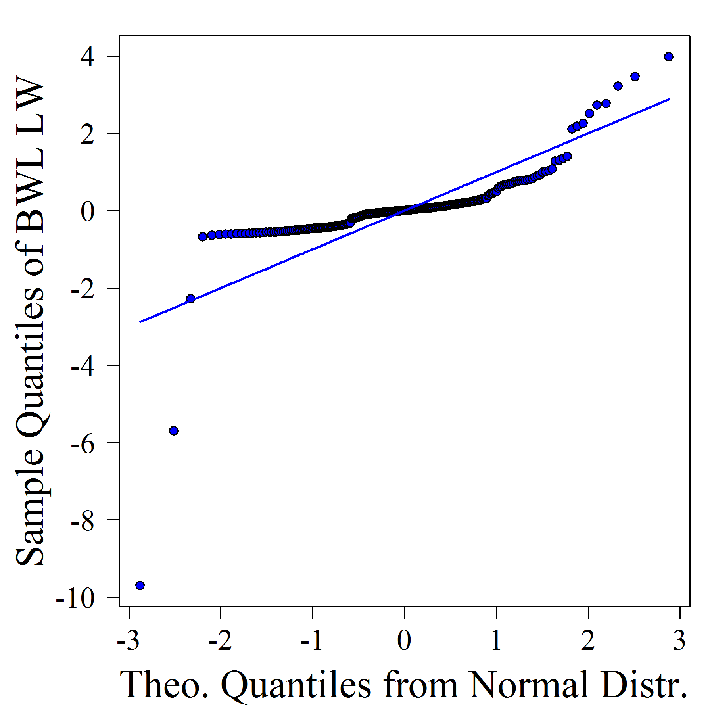
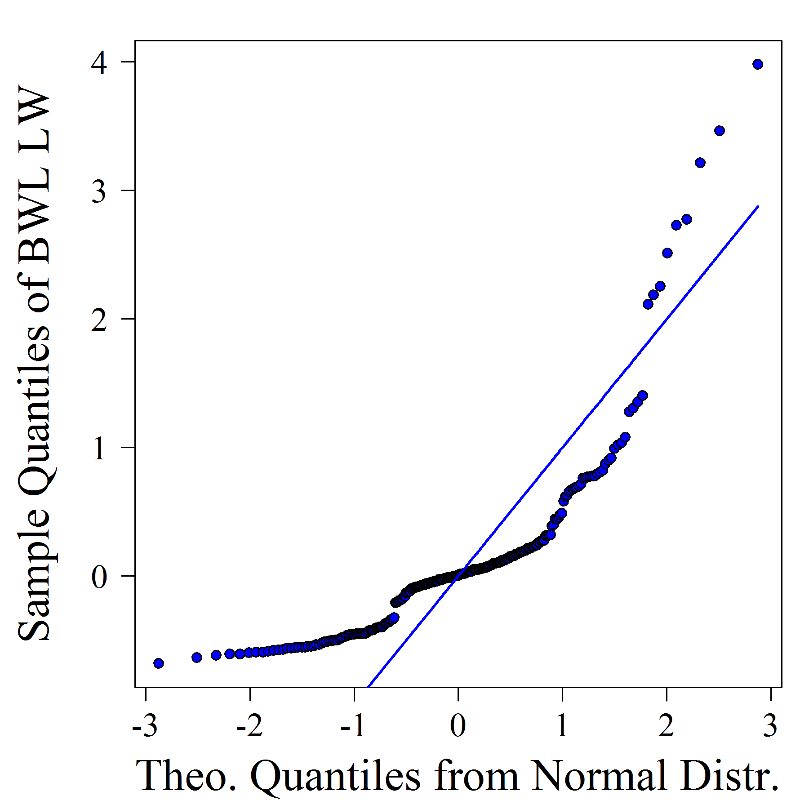
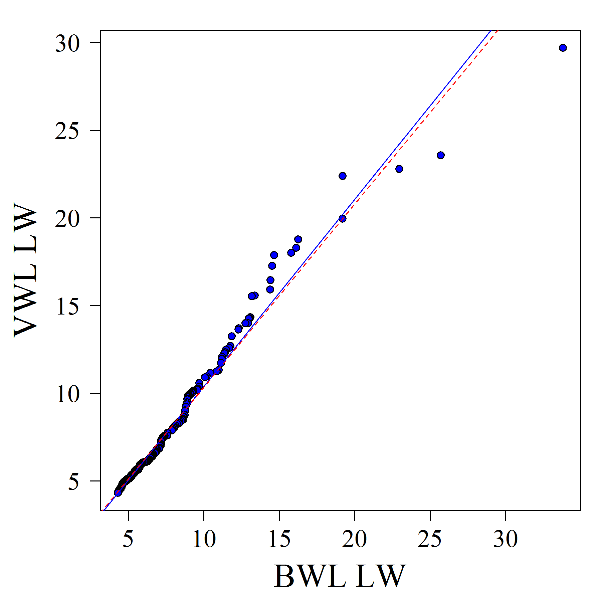

[](http://quantlet.de/)

## [](http://quantlet.de/) **ARRqrqqhb** [](http://quantlet.de/)

```yaml

Name of QuantLet : ARRqrqqhb

Published in : ARR - Academic Rankings Research

Description : 'Creates a quantile regression of HB VWL 2015 score and HB BWL 2014 score,
furthermore a QQ-plot of BWL LW against a theoretical distribution of choice'

Keywords : 'quantile regression, plot, qq-plot,data visualization, visualization, analysis,
graphical representation, descriptive-statistics'

See also : 'ARRboxage, ARRboxgscit, ARRboxhb, ARRcormer, ARRdenmer2d, ARRdenmer3d, ARRhexage,
ARRhexcit, ARRhexhin, ARRhismer, ARRmosage, ARRmosagegr, ARRmossub, ARRpcpgscit, ARRpcphb,
ARRpcpmer, ARRpcprp, ARRscaage, ARRscamer'

Author : Alona Zharova

Submitted : Sat, April 30 2016 by Alona Zharova, Marius Sterling

Datafile : 'ARRdata.csv - The data set contains different researcher (3218 rows) of either RePEc
(77 columns), Handelsblatt (48 columns) ranking or both and their Google Scholar data (16 columns)
as well as age and subject fields (2 columns)'

Output : 'Scatterplot and Quantile Regression Fit (left) of the HB on VWL LW vs BWL LW for a sample
of 100 top researchers within these rankings. Superimposed on the plot is the 0.50 quantile
regression line (solid blue) and the least squares estimate of the conditional mean function
(dashed red line). The coefficient of determination of the median regression equals to 0.93. A QQ
plot (right) of the same sample of data versus a normal distribution'

```








### R Code:
```r

# clear variables and close windows
rm(list=ls(all=TRUE))
graphics.off()

# libraries
libraries = c("quantreg") # library(xtable)
lapply(libraries, function(x) if (!(x %in% installed.packages())) {install.packages(x)})
lapply(libraries, library, quietly = TRUE, character.only = TRUE)

# setting (font, color) for png output
font                 = "serif" # font Times
res                  = 300
#scatterplot
cex                  = 0.5  # size of plot symbol
cex_lab              = 2    # size of label symbols
cex_axis             = 1.5  # size of axes label symbols
cex_main             = 2    # size of main label symbols
#hexbinplot
label.size.main_axis = 2    # size of label symbols
label.size.support   = 1.25 # size of axes label symbols
col.from             = 0.2  # shading from this percentage on (number between 0 and 1)

quant_lap=function(len,opt){
  p =(1:len-0.5)/len # Rankit, also (Rank-0.5)/n
  if (opt=="normal") QL = qnorm(p)
  if (opt=="lognormal") QL = qlnorm(p)
  if (opt=="lognormal") QL = qlnorm(p)
  if (opt=="laplace") QL = -sign(p-0.5)*log(1-2*abs(p-0.5))
  return(QL)
}

# data input
data = read.csv2("ARRdata.csv", sep = ";", dec = ",", header = T, stringsAsFactors = FALSE)

# data selection
hb = data[, grepl(pattern = "hb_author", x = colnames(data)) | 
            (grepl(pattern = "2014|2015", x = colnames(data)) & 
             grepl(pattern = "_score", x = colnames(data)))]
X_bwllw = as.data.frame(cbind(hb_vwl2015_lw_score = na.exclude(sort(hb[, "hb_vwl2015_lw_score"], decreasing = T)), 
                              hb_bwl2014_lw_score = na.exclude(sort(hb[, "hb_bwl2014_lw_score"], decreasing = T))))

## quantile regression of VWL 2015 LW against BWL 2014 LW
rq_bwl_lw  = rq(hb_vwl2015_lw_score ~ hb_bwl2014_lw_score, data = X_bwllw)
r_bwl_lw   = resid(rq_bwl_lw)
res_bwl_lw = r_bwl_lw/sqrt(var(r_bwl_lw))

col = rep(x = "blue", times = length(res_bwl_lw))
png(file = "ARRqrhbBWLLW.png", width = 6, height = 6, units = "in", res = res, family = font)
  par(cex.lab = cex_lab, cex.axis = cex_axis, cex.main = cex_main, las = 1, pty = "s",mar = c(4, 5, 1, 1))
  plot(x = X_bwllw$hb_bwl2014_lw_score, y = X_bwllw$hb_vwl2015_lw_score, pch = 21,col = "black", 
       bg = col, xlab = "BWL LW", ylab = "VWL LW")
  abline(rq(hb_vwl2015_lw_score ~ hb_bwl2014_lw_score, data = X_bwllw, tau = 0.5), col = "blue")
  abline(lm(X_bwllw$hb_vwl2015_lw_score ~ X_bwllw$hb_bwl2014_lw_score), lty = 2, col = "red")
dev.off()

option = "normal"
QL = quant_lap(length(res_bwl_lw), opt = option)
simpleCap = function(x) {
  s = strsplit(x, " ")[[1]]
  paste(toupper(substring(s, 1, 1)), substring(s, 2), sep = "", collapse = " ")
}

png(file = paste0("ARRqq", strtrim(x = option, width = 3), "hbBWLLW.png"), height = 6, 
    width = 6, units = "in", res = res, family = font)
  par(cex.lab = cex_lab, cex.axis = cex_axis, cex.main = cex_main, las = 1, pty = "s", mar = c(4, 5, 1, 1))
  col1 = col[order(res_bwl_lw)]
  qqplot(QL, sort(res_bwl_lw), pch = 21, col = "black", bg = col1, 
         xlab = paste0("Theo. Quantiles from ", simpleCap(option), " Distr."), 
         ylab = ("Sample Quantiles of BWL LW"))
  lines(QL, QL, type = "l", col = "blue", lwd = 2)
dev.off()


png(paste0("ARRqq", strtrim(x = option, width = 3), "hbBWLLW_Outlierless.png"), height = 6, 
    width = 6, units = "in", res = res, family = font)
  par(cex.lab = cex_lab, cex.axis = cex_axis, cex.main = cex_main, las = 1, pty = "s", mar = c(4, 5, 1, 1))
  l = length(res_bwl_lw)
  res_bwl_lw_outlierless = sort(res_bwl_lw)[-c(1:3)]  #,(l-3):l)]
  QL2 = quant_lap(length(res_bwl_lw_outlierless), opt = option)
  col1 = col[order(res_bwl_lw_outlierless)]
  qqplot(QL2, sort(res_bwl_lw_outlierless), pch = 21, col = "black", bg = col1, 
         xlab = paste0("Theo. Quantiles from ", simpleCap(option), " Distr."), 
         ylab = ("Sample Quantiles of BWL LW"), )
  lines(QL2, QL2, type = "l", col = "blue", lwd = 2)
dev.off() 

```
