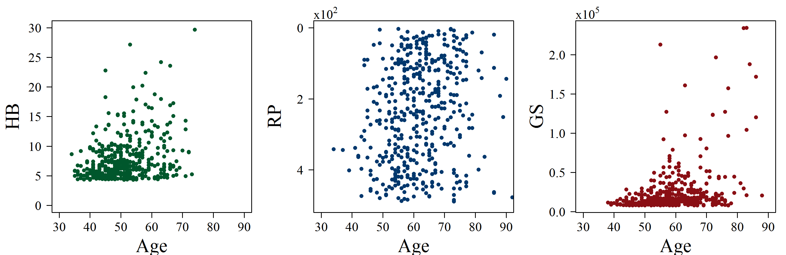

[](http://quantlet.de/)

## [](http://quantlet.de/) **ARRscaage** [](http://quantlet.de/)

```yaml

Name of QuantLet : ARRscaage

Published in : ARR - Academic Rankings Research

Description : 'Creates scatterplots of the main scores of Handelsblatt (HB), RePEc (RP) and Google
Scholar (GS) against the researchers age'

Keywords : 'plot, correlation, dependence, multivariate, multivariate analysis, visualization, data
visualization, analysis, descriptive-methods, descriptive, graphical representation, scatterplot,
plot, distribution'

See also : 'ARRboxage, ARRboxgscit, ARRboxhb, ARRcormer, ARRdenmer2d, ARRdenmer3d, ARRhexage,
ARRhexcit, ARRhexhin, ARRhismer, ARRmosage, ARRmosagegr, ARRmossub, ARRpcpgscit, ARRpcphb,
ARRpcpmer, ARRpcprp, ARRqrqqhb, ARRscamer'

Author : Alona Zharova

Submitted : Sat, April 30 2016 by Alona Zharova, Marius Sterling

Datafile : 'ARRdata.csv - The data set contains different researcher (3218 rows) of either RePEc
(77 columns), Handelsblatt (48 columns) ranking or both and their Google Scholar data (16 columns)
as well as age and subject fields (2 columns)'

Output : 'Scatterplots for age and ranking scores of HB, RP and GS for Top-458 scientists within
each ranking system for December 2015'

```




### R Code:
```r

# Close windows and clear variables
graphics.off()
rm(list = ls(all = TRUE))

# libraries
libraries = c("hexbin")
lapply(libraries,function(x)if(!(x %in% installed.packages())){install.packages(x)})
lapply(libraries,library,quietly=TRUE,character.only=TRUE)

# data input and selection and preparation
data     = read.csv2("ARRdata.csv", sep = ";", dec = ",", header = T, stringsAsFactors = FALSE)
data1    = data[!is.na(data$age_combined), ]
subagehb = na.exclude(data1[order(data1$hb_commonscore, decreasing = T), 
                            grep(pattern = "age_combined|hb_commonscore", colnames(data1))])
subagerp = na.exclude(data1[order(as.numeric(data1$rp_average_rank_score), decreasing = F), 
                            grep(pattern = "age_combined|rp_average_rank_score", colnames(data1))])
subagegs = na.exclude(data1[order(data1$gs_total_cites, decreasing = T), 
                            grep(pattern = "age_combined|gs_total_cites", colnames(data1))])

m      = 600
len    = min(dim(subagehb)[1], dim(subagegs)[1], dim(subagerp)[1])
if (m <= len) len = m
ageshb = subagehb[1:len, "age_combined"]
agesrp = subagerp[1:len, "age_combined"]
agesgs = subagegs[1:len, "age_combined"]
hb     = subagehb[1:len, "hb_commonscore"]
rp     = as.numeric(subagerp[1:len, "rp_average_rank_score"])
gs     = subagegs[1:len, "gs_total_cites"]


# color options 
max      = 255
az_red   = rgb(138, 15, 20, alpha = 0.999999 * max, maxColorValue = max)
az_green = rgb(0, 87, 44, alpha = 0.999999 * max, maxColorValue = max)
az_blue  = rgb(0, 55, 108, alpha = 0.999999 * max, maxColorValue = max)

# image setings
font                 = "serif" # font Times
fill_color           = c(az_red,az_green,az_blue)
cex                  = 1
cex.lab              = 2.25
cex.axis             = 1.5
cex.main             = 2
label.size.main_axis = 4
label.size.support   = 2
col.from             = 0.2
res                  = 300

png(file = "ARRscaage.png", width = 10, height = 3.25, units = "in", res = res, family = font)
  par(cex.lab = cex.lab, cex.axis = cex.axis, cex.main = cex.main, las = 1, mfrow = c(1,3), 
      oma = c(0, 0, 1, 0), mar = c(4.1, 5, 1, 1))
  # mosaic plot of age groups against Ranking groups
  plot(ageshb, hb, xlab = "Age", xlim = c(30, 90), ylab = "HB", ylim = c(0, 30), pch = 16, 
       col = az_green, cex = cex)
  plot(agesrp, rp/100, xlab = "Age", xlim = c(30, 90), ylab = "RP", ylim = c(ceiling(max(rp/100)),0), 
       pch = 16, col = az_blue, cex = cex, yaxt = "n")
  mtext(expression(displaystyle(x) * 10^2), adj = 0, padj = 0, outer = FALSE)
  axis(2, at = c(3:0) * 2, labels = c(3:0) * 2)
  plot(agesgs, gs/10^5, xlab = "Age", xlim = c(30, 90), ylab = "GS", pch = 16, col = az_red, 
       cex = cex)
  mtext(expression(displaystyle(x) * 10^5), adj = 0, padj = 0, outer = FALSE)
dev.off() 

```
