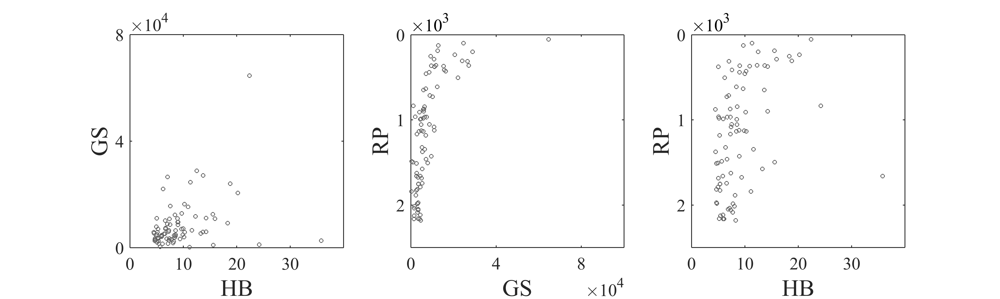

[](http://quantlet.de/)

## [](http://quantlet.de/) **ARRscamer** [](http://quantlet.de/)

```yaml

Name of QuantLet : ARRscamer

Published in : ARR - Academic Rankings Research

Description : 'Creates scatterplots of the main scores of Handelsblatt (HB), RePEc (RP) and Google
Scholar (GS) rankings'

Keywords : 'plot, correlation, dependence, multivariate, multivariate analysis, visualization, data
visualization, analysis, descriptive-methods, descriptive, graphical representation, scatterplot,
plot, distribution'

See also : 'ARRboxage, ARRboxgscit, ARRboxhb, ARRcormer, ARRdenmer2d, ARRdenmer3d, ARRhexage,
ARRhexcit, ARRhexhin, ARRhismer, ARRmosage, ARRmosagegr, ARRmossub, ARRpcpgscit, ARRpcphb,
ARRpcpmer, ARRpcprp, ARRqrqqhb, ARRscaage'

Author : Alona Zharova

Submitted : Sat, April 30 2016 by Alona Zharova, Marius Sterling

Datafile : 'ARRdata.dat - The data set contains different researcher (3218 rows) of either RePEc
(77 columns), Handelsblatt (48 columns) ranking or both and their Google Scholar data (16 columns)
as well as age and subject fields (2 columns)'

Output : 'Scatterplots of HB, RP and GS rankings for 84 researchers in December 2015. The
correlation equals to 0.44 for HB–GS plot, -0.64 for GS–RP and -0.46 for HB–RP'

```




### MATLAB Code:
```matlab
%% Clearing all variables
clear all; clc;
%% Figure settings
fonttype      = 'Times New Roman';
fontsize      = 20;
fontsize_axes = 15;
papersize     = [30 9];
cex           = 10;
az_gray       = [100 100 100]/255;
%% Data input
merge        = readtable('ARRdata.dat','Delimiter',';');
%% Function for data selection
substrmatch  = @(x,y) ~cellfun(@isempty,strfind(y,x));
findmatching = @(x,y) y(substrmatch(x,y));
%% Data selection (getting all researchers with HB commonscores, RP score and GS citations
x1 = substrmatch('hb_commonscore',merge.Properties.VariableNames);
x2 = substrmatch('rp_average_rank_score',merge.Properties.VariableNames);
x3 = substrmatch('gs_total_cites',merge.Properties.VariableNames);
x  = x1|x2|x3;
TF = ismissing(merge(:,x));
z1 = table2array(merge(~any(TF,2),{'hb_commonscore','rp_average_rank_score','gs_total_cites'}));
HB = z1(:, 1);
RP = z1(:, 2);
GS = z1(:, 3);
%% Creating figure
figure1 = figure('Visible','on','PaperPosition',[0 0 papersize],'PaperSize',papersize);
    hold on
    % creating image of 3 plot in a row
    subplot(1, 3, 1),
    % scatterplot
    scatter(HB,GS,cex,az_gray,'o');
        % setting labels
        xlabel('HB','FontSize',fontsize,'FontName',fonttype);
        ylabel('GS','FontSize',fontsize,'FontName',fonttype);
        set(gca,'FontSize',fontsize_axes,'FontName',fonttype,...
            'XTick',[0:10:30],'YTick',[0:40000:80000]);
        % setting length of axis same
        axis square;
        % setting a box around the plot
        box on;
    subplot(1, 3, 2),
    scatter(GS, -RP,cex,az_gray,'o');
        xlabel('GS','FontSize',fontsize,'FontName',fonttype);
        ylabel('RP','FontSize',fontsize,'FontName',fonttype);
        set(gca,'FontSize',fontsize_axes,'FontName',fonttype,...
            'XTick',[0:40000:80000],...
            'YTickLabel',{2:-1:0},'YTick',[sort(-(0:1000:2000))]);
        axis square;
        box on;
        yl=ylim;xl=xlim;
        e=log10(-yl(1));
        e=sign(e)*floor(abs(e));
        text(xl(1),yl(2),sprintf('\\times10^%d',e),'fontsize',fontsize_axes,'FontName',fonttype,'VerticalAlignment','bottom');
    subplot(1, 3, 3),
    scatter(HB, -RP,cex,az_gray,'o');
        xlabel('HB','FontSize',fontsize,'FontName',fonttype);
        ylabel('RP','FontSize',fontsize,'FontName',fonttype);
        set(gca,'FontSize',fontsize_axes,'FontName',fonttype,...
            'XTick',[0:10:30],'YTickLabel',{2:-1:0},'YTick',[sort(-(0:1000:2000))]);
        axis square;
        box on;
        yl=ylim;xl=xlim;
        e=log10(-yl(1));
        e=sign(e)*floor(abs(e));
        text(xl(1),yl(2),sprintf('\\times10^%d',e),'fontsize',fontsize_axes,'FontName',fonttype,'VerticalAlignment','bottom');
    hold off
%% Saving figure
set(figure1,'Position',[0 0 1 1]);
print(figure1,'-dpng','-r400','ARRscamer');

```
